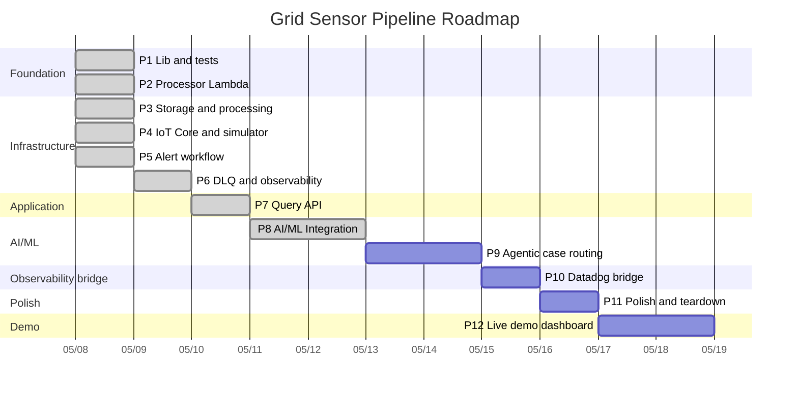

# Roadmap

Source of truth for the build sequence and current status. Updated at the end
of each phase. **Phases are units of work, not calendar days** — actual
elapsed time depends on focus and velocity.

---

## Status legend

| ✅ Complete | 🚧 In progress | ⏭️ Next up | ⏸️ Blocked | ⬜ Not started | 🎯 Stretch goal |
|---|---|---|---|---|---|

---

## Current state

**Today:** Day 10 (2026-06-18) — **Phase 15 opened; P15.1 (SDLC documentation) complete.** (POC core P1–P12 complete since Day 9, 2026-05-16.)
**Active scope:** 63/63 core sub-phases shipped. Day 9 closed out Phase 11 in a tight 30-minute lean session: decision-log index landed (`docs/decisions/README.md` — chronological table linking every per-phase log with a one-sentence summary), `_private/` scrub passed clean (all 7 files local-only with `-rw-------`, zero tracked, only benign meta-references in history), teardown verified (`post-destroy-check.sh` ran clean as part of last night's `npm run destroy`; Cost Explorer 24-48h confirmation pending as a passive wait), and Armando's voice pass landed the load-bearing README revision — new "Cloud-Native Telemetry & Event Processing Architecture" framing for green-energy + hyperscale audiences plus an 18-row capability table comparing the implemented AWS architecture against Azure, GCP, and Kubernetes/open-source equivalents. POC is portfolio-ready; further README iteration is continuous improvement, not blocking. Stretch phases (P13 auth hardening, P14 architecture-as-code visualizations) remain available if a specific interview audience demands them.
**Last shipped:** **P15.1 — SDLC documentation alignment for Phase 15 (Factory Floor Mapping & Asset Intelligence).** Documentation-only; no code. Created the decision log (`docs/decisions/phase-15-factory-floor-mapping.md`, six pre-flights led by the deterministic-mapping principle) + index row; two diagrams (`docs/diagrams/factory-floor-context.md`, `location-enrichment-flow.md`) registered in the diagrams README and linked from `system-overview.md`; the handoff spec (`docs/handoff/phase-15-factory-floor-mapping.md`) for the queued P15.2/P15.3; the operations runbook (`docs/operations/asset-registry-runbook.md`) + ops-README row; and the portfolio framing (`docs/portfolio/card.jsx` prose/chips + `portfolio-entry.md` section). ROADMAP updated with the Phase 15 section, table rows, matrix row, and Day 10 log entry. Three convention corrections applied: `ADR-012-*` → `phase-15-*.md`, `.mmd` → `.md` diagrams, portfolio "case-study" folded into the existing card/entry kit. **Note:** docs are Claude-drafted under timeline-priority mode; need Armando voice pass before public publication.
**Active phase:** **Phase 15 — Factory Floor Mapping & Asset Intelligence**, opened 2026-06-18 (post-POC capability extension). P15.1 (SDLC documentation alignment) **complete** (2026-06-18); **P15.2 (domain model + seed data) is next**, P15.3 (deterministic enrichment service) after — both queued, not started. This phase evolves the pipeline from telemetry-centric to asset-centric: sensor events get mapped to real/simulated factory-floor assets, indoor coordinates, zones, and production lines so alerts become location-aware operational incidents. Deterministic services own all factual mapping; the LLM/LangGraph layer only summarizes the structured context — it never invents physical locations.
**Cost reminder:** Run `npm run destroy` at the end of each dev session — Kinesis shard time accrues at ~$0.36/day. Bedrock is usage-based (no idle cost) but a runaway prompt loop can burn meaningful spend in an afternoon — `BedrockTokens-Runaway` alarm (>1M tokens/60min) caps that.

---

## Progress

### Overall

```
Core (P1-P12):     [████████████████████] 100%  (63 / 63 sub-phases)
Stretch (P13-P14): [░░░░░░░░░░░░░░░░░░░░]   0%  ( 0 / 10 sub-phases)
Combined:          [█████████████████░░░]  86%  (63 / 73 sub-phases)

> Phase 12 was scoped down from 6 build sub-phases to 1 documentation
> deliverable on 2026-05-15 — see the Phase 12 section for the
> rationale. The active-scope denominator dropped from 68 to 63
> accordingly; the deprecated build plan is retained in the body
> for historical reference + future revival. Phase 11 closed on
> 2026-05-16 in a 30-minute lean session.
```

> **Core** is the MVP — what reviewers expect to see for the JD scope.
> Phase 12 (Live demo dashboard) closes the core deliverable: pipeline
> live, observable, demonstrable. **Stretch** is what ships only if
> there's time and audience demand: P13 (auth & security hardening,
> *strong* stretch) and P14 (architecture & live visualizations,
> regular stretch). The core/stretch split matters because progress
> is honest only when "what's required to defend the project" is
> separated from "what's nice to have."
>
> *Day 2 evening scope expansion:* Two new CORE phases inserted to
> address JD's required AI/ML stack — Phase 8 (Bedrock + LangChain +
> LangGraph + MCP) and Phase 9 (Agentic case routing). Old P8-P12
> renumbered to P10-P14; P13 + P14 swapped so auth precedes viz in
> the stretch order.

### By phase

| # | Phase | Bar | % | Sub-phases | Status |
|---|---|---|---|---|---|
| 1 | Lib & test foundation        | `██████████` | 100% | 9/9 | ✅ |
| 2 | Processor Lambda             | `██████████` | 100% | 4/4 | ✅ |
| 3 | Storage + processing stacks  | `██████████` | 100% | 6/6 | ✅ |
| 4 | IoT Core + simulator         | `██████████` | 100% | 6/6 | ✅ |
| 5 | Alert workflow               | `██████████` | 100% | 6/6 | ✅ |
| 6 | DLQ + observability          | `██████████` | 100% | 6/6 | ✅ |
| 7 | Query API                    | `██████████` | 100% | 6/6 | ✅ |
| 8 | AI/ML Integration            | `██████████` | 100% | 6/6 | ✅ |
| 9 | Agentic case routing         | `██████████` | 100% | 6/6 | ✅ |
| 10 | Datadog bridge              | `██████████` | 100% | 3/3 | ✅ |
| 11 | Polish & teardown           | `██████████` | 100% | 4/4 | ✅ |
| 12 | Live demo dashboard (docs)  | `██████████` | 100% | 1/1 | ✅ |
| 13 | Authentication & security hardening (strong stretch) | `░░░░░░░░░░` |   0% | 0/6 | 🎯 |
| 14 | Architecture & live visualizations (stretch) | `░░░░░░░░░░` |   0% | 0/4 | 🎯 |
| 15 | Factory Floor Mapping & Asset Intelligence | `███░░░░░░░` |  33% | 1/3 | 🚧 |

### Gantt — phases on a timeline

GitHub renders this Mermaid block inline. For LinkedIn/decks, export with
`mmdc -i ROADMAP.md -o roadmap.png` or screenshot the rendered version.



### Phase × Requirements matrix

Maps each phase to the CLAUDE.md architectural invariants and hard rules it
satisfies. This is the requirements-alignment view: progress isn't just
"code shipped" — it's "contract clauses honored."

| Phase | Status | CLAUDE.md invariants satisfied | CLAUDE.md hard rules satisfied | Notes |
|---|---|---|---|---|
| P1 | ✅ | #2 (no I/O in `lib/`), #3 (`threshold.ts` is pure) | #1 (no `any`), #2 (no `console.log`), #3 (no bare `catch`), #4 (no hardcoded names) | Foundation that subsequent invariants are enforced against |
| P2 | ✅ | #1 (validate at I/O boundary), #4 (no business logic in handler), #5 (idempotency = Kinesis seq#), #7 (always `batchItemFailures`), #8 (metrics in `finally`) | #1, #2, #3, #4 (continued) | Six contract clauses honored in 195 lines |
| P3 | ✅ | #6 (`attribute_not_exists(pk)` enforced at write time, **proven via "Duplicate write swallowed" log entry on duplicate Kinesis put**), #9 (`bisectBatchOnError: true` on ESM, locked by template assertions, **proven via poison-pill → DLQ smoke test**) | #4 (resource names from CDK context), #5 (no `--require-approval never` until stable) | All deployed and smoke-tested end-to-end |
| P4 | 🚧 | #1 (validation continues at I/O boundary — simulator emits well-formed events that the processor's validator accepts) | #4 (resource names from CDK context) | Code shipped; deploy + smoke test pending. `ThresholdAlertRule` SQL will mirror `threshold.ts` (P5 wires it) |
| P5 | ✅ | #10 (Step Functions Standard for alerting, locked by template assertions, **proven via 4 Step Functions executions started by simulator breach mode, all reaching `Alert notified` with bimodal threshold distribution**) | — | Same predicate as `lib/threshold.ts` mirrored into IoT Rules SQL — keep in lockstep |
| P6 | 🚧 | — | — | Code shipped: DLQ inspector + observability stack with 3 alarms (verbatim CLAUDE.md thresholds) + dashboard. Deploy + chaos verification pending |
| P7 | 🚧 | #1 (validate at the API boundary too — separate `queryParamsSchema` for the path/query params) | — | Read-only IAM via `grantReadData`; no PutItem/UpdateItem/DeleteItem in any policy (locked by template assertion). Auth deferred to Phase 14 |
| P8 | ⏭️ | #1 (Bedrock fallback to JSON narrative if LLM unavailable — alert never blocked on AI), #4 (alert handler stays orchestration; LangGraph reasoning lives inside one Step Functions task — hybrid pattern) | #1, #4 | AI/ML core: Bedrock + LangChain + LangGraph + MCP. Keeps Step Functions outer, adds agentic inner |
| P9 | ⬜ | #6 (case-tracker dedup via `attribute_not_exists(pk)` on the new cases table — same pattern as P2 readings dedup), #7 (partial-success result from tool execution; per-channel failures don't block other channels) | — | Stubbed SMS channel + real email channel (via SNS subscription on existing P5 topic; SES as documented future migration). Routing matrix as data; LLM as override |
| P10 | ⬜ | — | — | Pluggable observability via EMF (formerly P8) |
| P11 | ⬜ | — | #6 (`cdk destroy --all` after dev sessions) | Final teardown verification (formerly P9) |
| P12 | ⬜ | — | — | Demo surface only; reads existing metrics. Adds operational visibility for portfolio reviewers without changing pipeline contracts (formerly P10) |
| P13 | 🎯 | — | — | Strong stretch — auth & security hardening (prioritized over P14 since security has more portfolio + production weight than visualizations) |
| P14 | 🎯 | — | — | Stretch — architecture & live visualizations |
| P15 | 🚧 | #1 (validate enriched events + registry/seed data at the I/O boundary via Zod), #2 (no I/O in `lib/factory-floor/` mapping logic), #3 (enrichment is a pure deterministic function — independently testable) | #1 (no `any`), #2 (no `console.log`), #3 (no bare `catch`) | Asset-centric extension. **Deterministic services own all factual mapping; the LLM only summarizes structured context — never invents physical locations.** |

**Legend.** Invariants and rules numbered per `CLAUDE.md`. The matrix is
additive — once a clause is satisfied by an earlier phase, later phases
inherit and must not violate it.

## Notation

- **P<N>** — phase number (e.g., P2)
- **P<N>.<M>** — sub-phase within a phase (e.g., P1.2 = validator)
- **Day N (YYYY-MM-DD)** — calendar day reference in the daily log
- Each phase below numbers its sub-phases so the daily log can reference them
  precisely (`Day 3 (2026-05-10) — completed P2.1, started P2.2`).

---

## Phases at a glance

| # | Phase | Status | Primary deliverable | Decision log |
|---|---|---|---|---|
| 1 | Lib & test foundation | ✅ | Types · validator · threshold · repository · Powertools singletons · unit tests | [`docs/decisions/day-01-lib-foundation.md`](docs/decisions/day-01-lib-foundation.md) |
| 2 | Processor Lambda | ✅ | Kinesis ESM handler with Powertools idempotency, EMF metrics, partial-failure isolation | [`docs/decisions/phase-02-processor.md`](docs/decisions/phase-02-processor.md) |
| 3 | Storage + processing stacks | ✅ | CDK: Kinesis · DynamoDB · processor Lambda + ESM · DLQ — pipeline live | [`docs/decisions/phase-03-storage-processing.md`](docs/decisions/phase-03-storage-processing.md) |
| 4 | IoT Core + simulator | ✅ | IoT Rules: telemetry → Kinesis · simulator Lambda (threshold breaches deferred to P5) | [`docs/decisions/phase-04-iot-simulator.md`](docs/decisions/phase-04-iot-simulator.md) |
| 5 | Alert workflow | ✅ | Step Functions Standard: NotifyOps → Wait → IsAcknowledged → Escalate · alert-handler Lambda | [`docs/decisions/phase-05-alert-workflow.md`](docs/decisions/phase-05-alert-workflow.md) |
| 6 | DLQ + observability | 🚧 | DLQ inspector Lambda · CloudWatch dashboard · alarms (DLQ depth, P99, SF failures) | [`docs/decisions/phase-06-dlq-observability.md`](docs/decisions/phase-06-dlq-observability.md) |
| 7 | Query API | 🚧 | API Gateway + query Lambda · `GET /sensors/{id}/readings?from=&to=` | [`docs/decisions/phase-07-query-api.md`](docs/decisions/phase-07-query-api.md) |
| 8 | AI/ML Integration | ⏭️ | Bedrock-powered narratives · LangChain prompt templates · LangGraph agentic flow inside alert handler · MCP server with read-only query tools | [`docs/decisions/phase-08-ai-ml-integration.md`](docs/decisions/phase-08-ai-ml-integration.md) |
| 9 | Agentic case routing | ⬜ | Real email channel (SNS subscription on P5 topic) + stubbed SMS channel · uniform adapter interface · idempotency-aware case persistence · partial-success failure isolation across channels · SES as documented future migration | [`docs/decisions/phase-09-agentic-case-routing.md`](docs/decisions/phase-09-agentic-case-routing.md) |
| 10 | Datadog bridge | ⬜ | Datadog Lambda Extension layer wired (or design-doc-only if not deployed) | _pending_ |
| 11 | Polish & teardown | ⬜ | README revision · architecture diagram · cost analysis · `cdk destroy` verification | _pending_ |
| 12 | Live demo dashboard | ⬜ | CloudWatch (CDK, quick win) · Grafana (depth + Aireon experience callback) · simulator trigger button · portfolio embed | _pending_ |
| 13 | Authentication & security hardening (strong stretch) | 🎯 | API Gateway throttling · API key + usage plan · Cognito user pool · IoT Fleet Provisioning · Secrets Manager · security model docs | _pending_ |
| 14 | Architecture & live visualizations (stretch) | 🎯 | Static architecture diagram suite · X-Ray service map embed · animated data flow · live event stream viewer | _pending_ |
| 15 | Factory Floor Mapping & Asset Intelligence | 🚧 | Sensor→asset→location→zone enrichment so alerts become location-aware incidents tied to real equipment, production lines, and response zones. Deterministic enrichment owns the mapping; LLM summarizes only | [`docs/decisions/phase-15-factory-floor-mapping.md`](docs/decisions/phase-15-factory-floor-mapping.md) |

---

## Phase 1 — Lib & test foundation ✅

**Goal.** Establish the typed I/O boundary, pure logic primitives, and the
DynamoDB abstraction with exhaustive unit tests. No infrastructure yet.

**Sub-phases & deliverables:**
- ✅ **P1.1** Domain types — `src/lib/types.ts` (`SensorEvent`, `SensorReading`, `AlertContext`, `ReadingType`)
- ✅ **P1.2** Validator — `src/lib/validator.ts` (Zod schema, `validateSensorEvent()`, strict, ISO 8601, sensorId regex)
- ✅ **P1.3** Threshold — `src/lib/threshold.ts` (pure `evaluateThreshold()`, NERC ±0.5 Hz / 120 V ±5 % defaults)
- ✅ **P1.4** Repository — `src/lib/repository.ts` (`SensorRepository`, `attribute_not_exists(pk)` writes, SK-range queries)
- ✅ **P1.5** Powertools singletons — `src/lib/{logger,tracer,metrics}.ts` under namespace `GridSensorPipeline`
- ✅ **P1.6** Unit tests — `src/__tests__/{validator,threshold,repository}.test.ts` (boundary matrix, mocked DocumentClient, purity assertions)
- ✅ **P1.7** Project scaffold — `package.json` (npm, Node ≥20), `tsconfig.json` (strict mode), `jest.config.js` (ts-jest), `eslint.config.mjs` (flat config), `.gitignore`
- ✅ **P1.8** Docs foundation — `docs/README.md`, `docs/review-checklist.md`, `docs/decisions/day-01-lib-foundation.md`, `docs/_private/interview-prep.md`
- ✅ **P1.9** Roadmap — `ROADMAP.md` (this file)

**Acceptance criteria:**
- [x] CLAUDE.md invariants 1-3 satisfied (validate at boundary, no I/O in lib, threshold is pure)
- [x] No `any`, no `console.log`, no bare `catch`
- [ ] `npm install && npm test && npm run build && npm run lint` clean on local machine

**Where to look:** [`docs/decisions/day-01-lib-foundation.md`](docs/decisions/day-01-lib-foundation.md), [`docs/review-checklist.md`](docs/review-checklist.md)

---

## Phase 2 — Processor Lambda ✅

**Goal.** Wire the Kinesis Event Source Mapping → handler → repository path
with idempotency, partial-failure isolation, and structured observability.

**Sub-phases & deliverables:**
- ✅ **P2.1** Processor handler — `src/handlers/processor.ts`
  - Decode Kinesis record → `validateSensorEvent()` → `repo.putReading()`
  - Wrapped: `tracer.captureLambdaHandler` + `logger.injectLambdaContext`
  - Per-record `makeIdempotent` keyed on `record.kinesis.sequenceNumber` via `eventKeyJmesPath`
  - Catches `ConditionalCheckFailedException` (by `err.name`) → no-op success
  - All other errors → `batchItemFailures` entry
  - EMF metrics: `EventsProcessed` + `ProcessingLatencyMs` (with `ReadingType` dimension via `metrics.singleMetric()`); `ValidationErrors`, `DuplicateWrites`, `PartialBatchFailures` on the shared instance
  - `metrics.publishStoredMetrics()` in `finally` (hard rule #8)
- ✅ **P2.2** Processor unit tests — `src/__tests__/processor.test.ts`
  - Happy path — full batch processed
  - Mixed batch — single bad record isolated
  - Full-failure batch — every record in `batchItemFailures`
  - Conditional swallow — `ConditionalCheckFailedException` returns success
  - Throttling does NOT get swallowed
  - Non-Error thrown values do NOT get swallowed
  - Mixed failure modes (validation + duplicate + throttle in one batch)
  - `isConditionalCheckFailed` helper unit tests (name match, similar names, non-Error values)
  - `IDEMPOTENCY_TTL_SECONDS` bounds check vs. Kinesis retention
- ✅ **P2.3** Decision log — `docs/decisions/phase-02-processor.md` (3 pre-flight decisions captured)
- ✅ **P2.4** Review checklist & interview-prep updates for Phase 2

**Acceptance criteria:**
- All processor test cases green
- Structured errors include sensorId or sequence number
- `metrics.publishStoredMetrics()` reachable on every code path

**Open decisions to resolve at start:**
1. Idempotency expiry window — recommend 24-26 h to match Kinesis retention
2. Conditional-failure swallow scope — recommend: only `ConditionalCheckFailedException` name match
3. `ReadingType` metric dimension — recommend: include (5 cardinality, cheap on CloudWatch)

---

## Phase 3 — Storage + processing CDK stacks ✅

**Goal.** First infrastructure phase. Stand up the storage and streaming
backbone, deploy the processor Lambda with the ESM, accept live events.

**Sub-phases & deliverables:**
- ✅ **P3.1** CDK app entrypoint — `infra/bin/app.ts`, `cdk.json`
- ✅ **P3.2** Storage stack — `infra/lib/storage-stack.ts` (readings table with `pk`/`sk`/TTL + GSI on `readingType + timestamp`, idempotency table)
- ✅ **P3.3** Kinesis stack — `infra/lib/kinesis-stack.ts` (Data Stream 1 shard / 24 h retention + Firehose → S3 cold archive with lifecycle IA→Glacier→expire; JSON+GZIP, Parquet deferred)
- ✅ **P3.4** Processing stack — `infra/lib/processing-stack.ts` (Processor Lambda · ESM with `bisectBatchOnError` + `reportBatchItemFailures` + retry=5 · SQS DLQ · IAM grants); CDK template assertions in `infra/__tests__/processing-stack.test.ts` lock the safety flags
- ✅ **P3.5** Bootstrap + first deploy — three stacks deployed (`GridSensorStorageStack`, `GridSensorKinesisStack`, `GridSensorProcessingStack`); four real-world snags surfaced and fixed in flight (see decision-log addendum below)
- ✅ **P3.6** Smoke test — Kinesis put-record → DynamoDB row verified, idempotent retry confirmed (`Duplicate write swallowed` log line), DLQ poison-pill confirmed (DLQ depth ≥ 1 after garbage payload)

**Acceptance criteria:**
- Full pipeline accepts a record from Kinesis to DynamoDB
- Idempotent retry verified (put twice, see one item)
- DLQ receives a deliberately invalid record after retries
- Cost teardown: `cdk destroy --all` removes all resources

**Dependencies:** Phase 2 complete.

---

## Phase 4 — IoT Core + simulator ✅

**Goal.** Replace the manual `put-record` with the real device path —
MQTT publish to IoT Core, Rules Engine routing to Kinesis and Step Functions.

**Sub-phases & deliverables:**
- ✅ **P4.1** IoT stack — `infra/lib/iot-stack.ts`
  - IoT data endpoint discovery via `AwsCustomResource`
  - IoT Rules role with inline `kinesis:PutRecord`/`PutRecords` policy
  - `AllTelemetryRule` — `SELECT *, topic(2) AS sensorId FROM 'sensors/+/telemetry'` → Kinesis (partition key `${sensorId}`)
  - Simulator Lambda (Node 20, 256 MB, X-Ray active) with `iot:Publish` scoped to `sensors/*/telemetry`
  - `ThresholdAlertRule` deferred to P5 (depends on Step Functions ARN)
  - Device certificates intentionally omitted (Fleet Provisioning is the prod path; simulator uses IAM auth via Data Plane SDK)
- ✅ **P4.2** Simulator handler — `src/handlers/simulator.ts` (Box-Muller Gaussian generator, 5-sensor pool, optional `--breach` mode, EMF metrics)
- ✅ **P4.3** Simulate script — `scripts/simulate.ts` (CLI driver: `--count`, `--breach`, `--function`, `--region`); `npm run simulate -- --count 50`
- ✅ **P4.4** Endpoint wiring — self-bootstrapping via `iot:DescribeEndpoint` custom resource at deploy time
- ✅ CDK template assertions — `infra/__tests__/iot-stack.test.ts` locks rule SQL, partition key, role policies, simulator IAM scope
- ✅ **P4.5** Deploy — `GridSensorIotStack` provisioned in account
- ✅ **P4.6** Smoke test — `npm run simulate -- --count 50` published 50 events; all reached DynamoDB through IoT → Kinesis → ESM → processor → repository path; breach mode tested (5 events, no failures)

**Acceptance criteria:**
- `npx ts-node scripts/simulate.ts --count 50` results in 50 items in DynamoDB
- IoT Rules SQL filter matches `threshold.ts` predicate exactly (cross-referenced)
- Threshold breach in simulator triggers a Step Functions execution

**Dependencies:** Phase 3 deployed; Phase 5 stack at least defined (alert state machine ARN must exist for the IoT rule to reference).

---

## Phase 5 — Alert workflow ✅

**Goal.** Auditable, long-running alert escalation backed by Step Functions
Standard.

**Sub-phases & deliverables:**
- ✅ **P5.1** Alert handler — `src/handlers/alert-handler.ts` (single Lambda for both NotifyOps and EscalateToOnCall, differentiated by `escalated: true` flag; reuses validator + threshold modules; per-record metric dimensioning via `singleMetric()`)
- ✅ **P5.2** Alert workflow stack — `infra/lib/alert-workflow-stack.ts` (Standard Workflow with `NotifyOps → WaitForAck → IsAcknowledged → AlertResolved | EscalateToOnCall → AlertResolved`; X-Ray active; ALL-level CloudWatch logging with execution data; 1-hour timeout; SNS topic with no subscriptions)
- ✅ **P5.3** IoT rule wiring — `infra/lib/iot-stack.ts` extended with conditional `ThresholdAlertRule` when `alertStateMachine` prop provided; conditional `StepFunctionsStart` inline policy on the IoT Rules role
- ✅ **P5.4** Cross-stack composition — `infra/bin/app.ts` instantiates `AlertWorkflowStack` before `IotStack`, passes state machine via constructor prop
- ✅ CDK template assertions — `infra/__tests__/alert-workflow-stack.test.ts` locks Standard type, X-Ray, ALL-level logging, runtime, env vars, SNS publish grant
- ✅ **P5.5** Deploy — `GridSensorAlertWorkflowStack` provisioned; `GridSensorIotStack` updated with `ThresholdAlertRule` + `StepFunctionsStart` inline policy. L2 interface drift fix landed (`stateMachineName` exposed as separate prop)
- ✅ **P5.6** Smoke test — `npm run simulate -- --count 5 --breach` started 4 Step Functions executions (4 breach readings of voltage/frequency out of 5 events; one was a non-thresholded readingType). Alert handler logs confirmed all 4 reaching `Alert notified` with bimodal distribution as designed (frequency 59.092 Hz, voltage 109.876/111.25/129.411 V across sensor-002 and sensor-003)

**Acceptance criteria:**
- Triggering a threshold breach via simulator runs the full state machine
- Execution history retained, viewable in console
- Mocked ack via SDK call resolves the workflow without escalation

**Dependencies:** Phase 4 IoT rule needs the state machine ARN.

---

## Phase 6 — DLQ + observability ✅

**Goal.** Production-grade visibility — dashboards, alarms, DLQ inspection.

**Sub-phases & deliverables:**
- ✅ **P6.1** DLQ inspector — `src/handlers/dlq-inspector.ts`
  (SQS-triggered, parses Kinesis failure envelope, structured-logs
  sequence range + reason, emits `DlqMessagesReceived`, publishes to
  ops-alerts SNS; optional replay env-flagged off by default)
- ✅ **P6.2** Observability stack — `infra/lib/observability-stack.ts`
  (DLQ inspector Lambda + log group, ops-alerts SNS topic, single
  dashboard with throughput / latency p50-p95-p99 / validation errors /
  partial batch failures / duplicate writes / DLQ depth / alerts /
  Step Functions execution counts)
- ✅ **P6.3** Alarms — three with SNS actions:
  `GridSensor-DLQ-Messages` (≥ 1, 1 period),
  `GridSensor-P99-Latency` (> 2000 ms, 3 periods),
  `AlertWorkflow-Failures` (≥ 1, 1 period)
- ✅ **P6.4** DLQ inspector wired to `processing.dlq` via cross-stack
  prop; CDK template assertions in
  `infra/__tests__/observability-stack.test.ts`
- ✅ **P6.5** Deploy — `GridSensorObservabilityStack` provisioned;
  dashboard URL renders. Bug surfaced + fixed: Powertools
  `singleMetric()` flushes custom dimensions after first `addMetric`,
  so multiple metrics on one instance lost `ReadingType`. Fix in
  `processor.ts` is one `singleMetric()` per metric. Lesson captured
  in `docs/decisions/phase-06-dlq-observability.md` §Deploy lesson.
- ✅ **P6.6** Chaos verification — DLQ alarm path verified
  end-to-end via inspector logs (`failureReason: RetryAttemptsExhausted`,
  `approximateInvokeCount: 6`, `DlqMessagesReceived` metric incremented
  across two invocations). DLQ depth read 0 on the alarm sample window
  because the inspector consumed faster than the alarm period — by
  design, and the inspector log is the authoritative proof the path
  fired. P99 + SF-failures alarm paths pending future forced-failure
  drills (acceptable: same pattern, no new infra).

**Acceptance criteria:**
- Dashboard renders with non-empty data after a simulator run
- Each alarm fires under a forced failure scenario
- DLQ inspector logs include enough context for debugging

**Dependencies:** Phase 5.

---

## Phase 7 — Query API ✅

**Goal.** External read API surface over the readings table.

**Sub-phases & deliverables:**
- ✅ **P7.1** Query handler — `src/handlers/query.ts` (Zod-validated path/query params, calls `repo.queryReadings()`, returns `{sensorId, count, items}`, 400 on validation, 500 on unexpected; EMF metrics for queries, latency, items returned, validation errors, failures)
- ✅ **P7.2** Query stack — `infra/lib/query-stack.ts` (REST API with `GET /sensors/{sensorId}/readings`, X-Ray + access logging on, Lambda proxy integration, read-only DynamoDB grant, permissive CORS)
- ✅ **P7.3** CDK template assertions — `infra/__tests__/query-stack.test.ts` (locks REST-not-HTTP API type, route, env vars, tracing, IAM read-only-ness with explicit no-PutItem/UpdateItem/DeleteItem assertions)
- ✅ **P7.4** App wiring — `infra/bin/app.ts` instantiates `QueryStack` with `storage.readingsTable` cross-stack ref; Phase 7 decision log captures 6 pre-flight decisions (REST API choice, no-auth deferred to P12, repo reuse, two parallel Zod schemas, read-only IAM, permissive CORS)
- ✅ **P7.5** Deploy — `GridSensorQueryStack` provisioned at
  `https://buf166t00b.execute-api.us-east-1.amazonaws.com/prod/`
- ✅ **P7.6** Smoke test — five-curl sequence verified: positive (limit
  only) + positive (time-window) returned 200 with `{sensorId, count,
  items}`; bad sensorId pattern returned 400 with Zod `fieldErrors`;
  malformed `from` timestamp returned 400; unknown-but-valid sensorId
  returned 200 with `count: 0`.

**Acceptance criteria:**
- `curl` against the deployed endpoint returns simulator-emitted readings
- Bad timestamps return 400
- Pagination via `Limit` is exposed (consider a cursor for future enhancement)

**Dependencies:** Phase 3.

---

## Phase 8 — AI/ML Integration ✅

**Goal.** Bedrock-powered alert narratives, LangChain-templated prompts,
LangGraph-orchestrated agentic flow inside the alert handler, and an
MCP server exposing read-only query tools. Closes the gap between the
portfolio entry's claims and shipped reality. Addresses the JD's
*"Production experience with… AWS Bedrock, agentic workflows
(LangChain/LangGraph), and tool integrations (Model Context Protocol)"*
required skill verbatim.

**Architectural shape — hybrid Step Functions + LangGraph:**

Phase 5's Step Functions Standard Workflow stays as the durable,
auditable outer workflow (CLAUDE.md hard rule #10 unchanged). Phase 8
adds LangGraph **inside** the alert handler Lambda — invoked by the
existing `NotifyOps` task — for agentic decisioning.

```
[ThresholdAlertRule fires]
        ↓
   [NotifyOps Step Functions task → invokes alert-handler Lambda]
        ↓
   ┌───────────────────────────────────────────────────────┐
   │ LangGraph inside the Lambda:                          │
   │  Node 1: Classify breach severity (Bedrock + tools)   │
   │  Node 2: Determine routing strategy (LLM)             │
   │  Node 3: Generate channel narrative (Bedrock)         │
   │  Node 4: (Phase 9 expands this) Execute via tools     │
   └───────────────────────────────────────────────────────┘
        ↓
   [Returns to Step Functions; WaitForAck stays unchanged]
```

**Sub-phases & deliverables (implementation order; de-risk-first):**

- ✅ **P8.1** Bedrock model access + IAM scope — Sonnet 4.6 verified
  invokable through `us.anthropic.claude-sonnet-4-6` (US cross-region
  inference profile); resource-scoped `bedrock:InvokeModel` grant on
  the alert handler's IAM role covering BOTH the profile ARN and the
  underlying foundation-model ARN (no wildcards) — see
  `infra/lib/alert-workflow-stack.ts` and the matching positive +
  defense-in-depth no-wildcard assertions in
  `infra/__tests__/alert-workflow-stack.test.ts`. Deploy verified
  Day 3 morning; live IAM document confirmed via `aws iam
  get-role-policy`. Two real-world findings captured in the decision
  doc: (1) AWS retired the Model Access page mid-2025 — first-time
  Anthropic invocation triggers an inline use-case form, not a
  multi-day approval queue; (2) current-generation Anthropic models
  on Bedrock ship behind cross-region inference profiles only —
  invoking the bare foundation-model ID returns
  `ValidationException: ... isn't supported with on-demand throughput`,
  which is how we discovered the migration pattern.
- ✅ **P8.2** Client wiring + first unit test + runaway-cost alarm —
  `src/lib/llm-client.ts` wraps Bedrock via LangChain's
  `ChatBedrockConverse` (Converse API; abstracts away model-family
  request body formats — no `anthropic_version` wrapper needed).
  `invokeStructured(schema, messages)` returns Zod-typed parsed output.
  `maxRetries: 1` caps parse-failure spirals (cost guardrail). Emits
  `BedrockInvocations` (count), `BedrockLatencyMs`, `BedrockTokensUsed`
  (sum of input + output, defensively extracted across LangChain field
  variations `usage_metadata` vs `response_metadata.usage`), and
  `BedrockFallback` (on error). 8 unit tests cover happy path, both
  token-extraction fallbacks, missing-usage edge case, retry cap,
  model+region passing, error path, and lazy singleton behavior.
  CDK side: `BedrockTokens-Runaway` CloudWatch alarm in
  `infra/lib/observability-stack.ts` — Sum of `BedrockTokensUsed` >
  1,000,000 over a 60-minute window on the `grid-sensor-alert-handler`
  service dimension → ops-alerts SNS. Threshold rationale documented
  inline (~$9 of Sonnet 4.6 spend; well above normal-traffic burst,
  well below "I just lost meaningful money"). De-risks 80% of
  downstream nodes — every later node uses this same plumbing.
  Deps: `@langchain/core`, `@langchain/aws`, `@langchain/langgraph`
  installed at v1.x stable.
- ✅ **P8.3** Severity classifier node — `src/lib/severity-classifier.ts`
  exposes `classifySeverity(event, threshold) → Severity`. Output Zod
  schema locks `severity: P0|P1|P2|P3`, `confidence: [0, 1]`,
  `reasoning: 10-500 chars`. System prompt anchors all four tiers
  with explicit deviation magnitudes tied to NERC bands (>2 Hz
  outside band → P0, etc.) so classification is consistent across
  invocations. Defensive guard: throws on non-breach inputs (caller
  bug guard — severity classification only makes sense for events
  that exceeded a threshold). 14 unit tests in
  `src/__tests__/severity-classifier.test.ts` covering tier-mapping
  fixture matrix, non-breach guard, schema/messages contract, prompt
  content (sensorId/value/threshold), system-prompt anchors all four
  tiers, error propagation, and 5 schema-bounds tests. **Verification
  to run on resume:** `npm run build` + `npm test -- severity-classifier`
  + `npx cdk synth GridSensorObservabilityStack > /dev/null`.
- ✅ **P8.4** Routing strategy node + narrative generator node — two
  plain async functions, same shape as P8.3. `src/lib/routing-strategy.ts`
  exports `determineRouting(event, severity) → RoutingPlan` with an
  inline `BASELINE_MATRIX` (P0/P1/P2/P3 → channels + page) and a Zod
  refinement enforcing `overrideApplied ⇒ overrideReason` for audit.
  `src/lib/narrative-generator.ts` exports `generateNarratives(event,
  severity, routing) → Narratives` — single LLM call producing
  per-channel narratives (slack ≤280 chars, pagerduty ≤400, email
  ≤1200, status_page ≤600); schema-level length bounds double as a
  cost lever. ~33 unit tests across the two new files: tier-mapping
  fixture matrices, override-path tests, schema/messages contracts,
  prompt-content assertions, schema bounds, BASELINE_MATRIX integrity.
  Verification trio (build + tests + synth) green Day 4 morning.
- ✅ **P8.5** LangGraph wire-up + fail-soft fallback + deploy +
  fail-soft smoke test. `src/lib/alert-graph.ts` assembles three
  nodes (classify → route → narrate) into a `StateGraph` with
  lazy-singleton compiled-graph caching, replace-semantics state
  fields, and defensive node-wiring assertions. Exports
  `runAlertGraph(event) → AlertGraphState`. `src/handlers/alert-handler.ts`
  invokes the graph inside a try/catch; success path emits an
  enriched SNS payload with LLM tier classification + per-channel
  narratives + routing decision; failure path increments
  `BedrockFallback` and emits the Phase 5 deterministic JSON payload
  so the alert always reaches SNS. 13 unit tests across
  `alert-graph.test.ts` and `alert-handler.test.ts`. Deployed —
  Lambda bundle jumped from 93 KB to 1.0 MB (LangChain footprint;
  predicted); cold-start `Init Duration: 541-587 ms`, well within
  budget. **Fail-soft path verified in production** via 3 concurrent
  breach events: `BedrockFallback` metric incremented twice (EMF
  batched `[1,1]`); all three alerts reached SNS via the
  deterministic payload; `usedFallback: true` logged for each.
  **Happy-path verification pending Anthropic account-level use-case
  form approval** — error surfaced was `"Model use case details have
  not been submitted for this account"`. Not a code defect; surfaced
  only at production-shape invocation rather than the day-prior CLI
  test. Captured as a deploy lesson in `phase-08-ai-ml-integration.md`.
- ✅ **P8.6** MCP server with 3 read-only tools. `mcp-server/server.ts`
  (~340 lines) — stdio-transport `Server` from
  `@modelcontextprotocol/sdk` exposing `query_sensor_readings`
  (wraps Phase 7 Query API), `query_recent_breaches` (DynamoDB scan
  + inline threshold predicate mirroring `src/lib/threshold.ts`), and
  `get_alert_history` (Step Functions `ListExecutions` against the
  alert workflow state machine). Auto-resolves `QUERY_API_URL` +
  `ALERT_STATE_MACHINE_ARN` from CloudFormation stack outputs at
  first tool invocation so users don't need to manage env vars
  manually. Each tool has a complete JSON-schema input definition
  surfaced via the `tools/list` MCP method. Async-IIFE entrypoint
  (top-level `await` requires `module: es2022+`; project compiles
  to CJS for Lambda compatibility — IIFE works under any module
  setting). `mcp-server/README.md` documents standalone testing
  recipe, Claude Desktop + Claude Code config stanzas, env var
  reference, production migration path, and troubleshooting.
  `npm run mcp` is the launcher; `eslint` glob extended to cover
  `mcp-server/**/*.ts`. Protocol-layer verified via JSON-RPC stdin:
  `initialize` returns server capabilities + serverInfo;
  `tools/list` returns all three tool schemas. New deps:
  `@modelcontextprotocol/sdk`, `@aws-sdk/client-cloudformation`,
  `@aws-sdk/client-sfn`, `@aws-sdk/util-dynamodb`.

**Adjacent deliverables (not sub-phase-numbered):**
- Three learning notes — `aws-bedrock.md`, `langchain-langgraph.md`,
  `mcp-protocol.md`. Each filled with project anchors + self-test
  gate. Design-patterns index updated.
- `portfolio-entry.md` updated so "Bedrock-powered alert narratives"
  and "MCP server exposing the data API" claims are finally accurate.
- Phase 8 close-out commit + ROADMAP daily-log entry.

**Acceptance criteria:**
- Alert handler produces an LLM-generated narrative on breach.
- Bedrock outage falls back to JSON narrative; alert is never
  blocked.
- MCP server responds to `query_sensor_readings` from a real Claude
  client.
- LangGraph trace shows multi-node decision path.

**Dependencies:** Phase 5 (Step Functions outer workflow), Phase 7
(query API for the MCP server to wrap).

**Decision log:** [`docs/decisions/phase-08-ai-ml-integration.md`](docs/decisions/phase-08-ai-ml-integration.md)

---

## Phase 9 — Agentic case routing ⬜

**Goal.** Extend Phase 8's agentic flow with two-channel notification routing — **real email (via SNS subscription on the existing P5 topic) + stubbed SMS** — backed by idempotency-aware case persistence so Step Functions retries don't duplicate tickets. The architectural lesson is the **uniform adapter interface**: each channel implements the same `Promise<ChannelResult>` shape, the LangGraph dispatch loop is one map iteration over a `CHANNEL_HANDLERS` registry, and adding a future channel (Slack, PagerDuty, Jira, ServiceNow, status page) is a single new file + one map entry with the partial-success failure-isolation behavior free. Direct SES is the documented future migration when HTML formatting or sender identity become real requirements — also a single-file change inside the email adapter.

**Scope note.** Two scope changes landed on 2026-05-13. (1) **Channel inventory simplified** from five stubs + one real to one stub (SMS) + one real (email). Two channels exercise the adapter pattern, partial-success behavior, and idempotency layer as completely as five would, with materially less surface to maintain. (2) **Email implementation path changed from direct SES to SNS subscription.** Verification revealed the P5 alert-workflow SNS topic already exists; only an `EmailSubscription` was missing. Wiring the subscription is a ~5-minute CDK change that completes "email works end-to-end" without new IAM, new service surface, or sandbox-mode complexity. SES remains the production migration path; adapter pattern guarantees that swap is a single-file change. Decision log `phase-09-agentic-case-routing.md` revised in place to match both changes.

**Sub-phases & deliverables:**

- ✅ **P9.1** SMS stub channel adapter + P8 schema retrofit — `routing-strategy.ts` and `narrative-generator.ts` Zod schemas + `BASELINE_MATRIX` trimmed from `{slack, pagerduty, email, status_page}` to `{email, sms}`; `pageOnCall` collapsed into `channels.sms`. New `src/lib/cases/` tree with `types.ts`, `case-id.ts` (synthetic `MOCK-sms-{epochMs}-{hash6}` generator), `channels/sms-stub.ts` (Powertools `would_call` logging + `Promise<ChannelResult>` return), and `channels/index.ts` (CHANNEL_HANDLERS registry). Six test files updated or added — routing-strategy, narrative-generator, alert-handler, alert-graph, and a new sms-stub suite. All green. Two commits, retrofit + greenfield kept separate.
- ✅ **P9.2** Email channel via SNS subscription — `EmailSubscription` wired on the P5 alert-workflow SNS topic (recipient via CDK context `alertEmail`, default `armando.musto+alertreported@gmail.com`); `AlertEmailRecipient` CFN output for visibility. `src/lib/cases/channels/email.ts` adapter publishes via the existing SNS client, returns SNS `MessageId` as `caseId`, catches publish errors and returns `status: 'failed'` (always-resolves contract matching the SMS stub). `CHANNEL_HANDLERS` registry tightened to full `Record<CaseSystem, ChannelHandler>`. New `scripts/add-demo-recipient.sh` adds ad-hoc viewers at runtime without redeploy. Six files touched (3 infra + helper, 3 application). Verified end-to-end live: `simulate.ts --count 5 --breach` produced 2 Step Functions executions and 2 alert emails landed in inbox.
- ✅ **P9.3** Idempotency-aware case persistence — new `cases` DynamoDB table in `storage-stack.ts` (pk=`${sensorId}#${timestamp}#${readingType}`, sk=`'__metadata__'` or `caseSystem`, pay-per-request, PITR enabled, no TTL, `RemovalPolicy.DESTROY`). New `src/lib/cases/case-repository.ts` (anchor) with three row types, `buildCasePk` helper, and a `CaseRepository` class exposing find/create/update for both row types. Atomic + idempotent on creates via `ConditionExpression: 'attribute_not_exists(pk)'`; `ConditionalCheckFailedException` propagates to the caller as the dispatcher's "this is a retry" signal. Dynamic `UpdateExpression` construction with `#status` reserved-word aliasing and immutable-field skipping (`createdAt`, `channel`). 14 unit tests cover all paths including reserved-word handling + immutable-field defense-in-depth. Mixed-mode anchor work: Armando implemented `buildCasePk`, `findChannelCase`, `createChannelCase`; review caught a TypeScript type-annotation error + redundant validation + naming convention; Claude completed `updateChannelCase`, find/create/update for metadata, and all test bodies.
- ✅ **P9.4** LangGraph tool-execution node + partial-success dispatcher — new 4th node `executeToolsNode` in `src/lib/alert-graph.ts` runs after `generateNarratives`. Iterates `CHANNEL_HANDLERS` over routing-plan selections via `Promise.allSettled`; aggregates outcomes into `DispatchResult { delivered, failed, skipped }`. Per-channel input mapper (`buildChannelInput`) bridges breach context + narratives to each adapter's input shape. `ensureMetadata` + `dispatchChannel` helpers exercise the P9.3 conditional-write contract — catch `ConditionalCheckFailedException` from create methods as the "this is a retry" signal, fall back to update. Per-channel metrics: `CasesCreated`, `CasesRetried`, `AlertChannelFailures`, `DispatchLatencyMs`, all dimensioned by `Channel`. `SkipReason` enum: `retry_already_delivered | no_handler_registered | narrative_missing`. CDK wiring: `casesTable: dynamodb.ITable` prop on `AlertWorkflowStack`, `grantReadWriteData` to the alert handler role, `CASES_TABLE_NAME` env var. Alert handler payload extended with `dispatch: DispatchResult` for downstream visibility. Substantial test additions in `alert-graph.test.ts` (mocks for `CaseRepository` + `CHANNEL_HANDLERS`, five new describe blocks: first-encounter, retry idempotency, conditional-failure fallback, failure isolation, skip reasons, metadata ordering). Three test fixes for downstream impacts (the `MetricUnit`-as-type ambiguity in Powertools, the new `casesTable` prop required by `alert-workflow-stack.test.ts` context override + `observability-stack.test.ts` cross-stack helper). Live verified in AWS — deploy succeeded, simulator breach exercised the full chain, cases table writes confirmed. **Written end-to-end by Claude under Day 8 timeline-priority mode.**
- ✅ **P9.5** Documentation closing Phase 9. New `docs/learning/case-management-patterns.md` formalizes three patterns: conditional-write idempotency at a new boundary (P2 + P9 same primitive at two layers), partial-success failure isolation (fan-in + fan-out duals), exception-as-information (catch-and-fall-back contract). Includes the extension-point verification — a hypothetical-Slack-adapter file-diff sketch proving "adding a channel is 1 new file + 3 narrow additions, nothing else changes" per pre-flight 7's acceptance criterion. Decision log pre-flight 3 example reconciled to match shipped `DispatchResult` types. Three new patterns added to `docs/learning/_design-patterns-index.md`. Learning note is Claude-drafted under timeline-priority mode; Armando voice pass pending before public publication.
- ✅ **P9.6** Deploy + smoke test — live retry-idempotency verified end-to-end on 2026-05-15. Email subscription confirmation handled in P9.2 deploy; live execution this phase exposed a P5-legacy bug where the alert-handler's outer SNS publish was running unconditionally after the LangGraph and bypassing the dispatcher's case-table idempotency gate (first encounter = 2 emails, retry = 1 stray email). Fix: wrapped the outer publish in `if (usedFallback || isEscalated)` so the dispatcher is the sole delivery path on the happy path; outer publish remains the only mechanism for the fail-soft and escalation paths. New `scripts/verify-retry-idempotency.sh` invokes the alert-handler Lambda twice with identical input, snapshots the email-channel case row before and after, and asserts caseId stable + createdAt preserved + updatedAt advances + CasesRetried metric ticks. Post-fix run: same caseId across both invocations (`98c2cc86-…`), updatedAt advanced `17:13:38 → 17:14:12`, exactly 1 alert email landed in inbox. The script invokes the Lambda directly rather than driving Step Functions to keep verification fast (~10s/invocation vs. minutes through the ack-wait window) and to keep the inbox-count assertion clean (escalation would land a second `[P1 ESCALATED]` email otherwise — by design, but noise for this test).

**Acceptance criteria:**
- A P0 breach produces a real email at the configured address.
- The SMS stub logs a structured `would_call` entry with a `MOCK-sms-` case ID linked to the same case-table row.
- Same breach repeated produces UPDATEs, not duplicate rows in the cases table.
- One channel failing (simulated) doesn't block the other; the failure surfaces as a metric, not an exception.
- Adding a new channel later (Slack, PagerDuty, etc.) is verified to require only a new adapter file + one map entry in `CHANNEL_HANDLERS`, with no changes to the dispatcher, the routing logic, or the idempotency layer. (Confirm by sketching the file diff for a hypothetical Slack adapter in the decision log.)

**Dependencies:** Phase 8 (routing-strategy + narrative-generator schemas, both retrofitted in P9.1's first task). LangGraph node 4 (added in P9.4) is what calls these adapters.

**Decision log:** [`docs/decisions/phase-09-agentic-case-routing.md`](docs/decisions/phase-09-agentic-case-routing.md) — revised on 2026-05-13 to match both scope changes (channel count + email implementation path).

---

## Phase 10 — Datadog bridge ✅

**Goal.** Production observability path. Either deploy or document the
zero-app-code Datadog forwarding. **Deploy path taken on 2026-05-15** —
Datadog free trial covers the demo window; design-doc path moot.

**Sub-phases & deliverables (deploy path — TAKEN):**
- ✅ **P10.1** Datadog Lambda Extension layer (v75, x86_64) attached to both `grid-sensor-processor` and `grid-sensor-alert-handler` via a new `infra/lib/datadog-instrumentation.ts` helper. `maybeAttachDatadog(scope, fn, service)` is the one-line call sites use; reads `enableDatadog` from CDK context so the wiring is opt-in (default off keeps fresh-clone deploys + CI unchanged). Layer ARN constructed from `arn:aws:lambda:${region}:464622532012:layer:Datadog-Extension:${version}` with `ddExtensionVersion` context override for future bumps. APM tracing path intentionally deferred — would require the Node.js tracer layer + handler wrapping; out of scope for "EMF metrics visible in Datadog."
- ✅ **P10.2** `DD_API_KEY_SECRET_ARN`, `DD_SITE=us5.datadoghq.com`, `DD_ENV=poc`, `DD_SERVICE` (per-function), `DD_SERVERLESS_LOGS_ENABLED=true`, `DD_TRACE_ENABLED=false` env vars wired. API key stored in AWS Secrets Manager (`grid-sensor-pipeline/datadog-api-key`) and read via the canonical Datadog-recommended pattern rather than a plaintext env var — Secrets Manager grants emit `secretsmanager:GetSecretValue` + `DescribeSecret` scoped to the exact secret ARN on each Lambda's execution role. CDK test coverage: six new assertions per stack (default-off, throws on missing secret ARN, layer attached, env vars present, IAM grant scoped, context overrides honored) in `infra/__tests__/processing-stack.test.ts` and `alert-workflow-stack.test.ts`.
- ✅ **P10.3** Verification — Datadog Serverless view shows `grid-sensor-pipeline-processor` and `grid-sensor-pipeline-alert-handler` as tagged services with invocation count + duration + error rate populated. EMF custom metrics visible in Metrics Explorer under the `gridsensorpipeline.*` namespace (lowercased + dot-separated from the CloudWatch `GridSensorPipeline` namespace per Datadog's default mapping) alongside the same metric data in CloudWatch — both systems indexed the same EMF lines without any application-code change. The CloudFormation AWS integration also surfaced `grid-sensor-pipeline-query-api` as a third service via CloudWatch polling; query-api was intentionally not deep-instrumented (no Extension layer), so it shows surface telemetry only — that distinction is itself a clean talking point on the cost-vs-coverage tradeoff.

**Sub-phases & deliverables (design-doc path):** moot — deploy path
taken. Original P10.D1 / P10.D2 placeholders left in git history for
reference but not counted against Phase 10's 3/3.

**Acceptance criteria:**
- ✅ Same EMF metrics visible in both CloudWatch and Datadog.

**Datadog-flagged follow-ups (deferred to Phase 11 polish):**
- "Deprecated runtime" warning on Node.js 20 — AWS Lambda enters
  block-update around May/June 2026. Fix is a one-line CDK change
  (`runtime: lambda.Runtime.NODEJS_22_X` + bundling target `node22`)
  on each Lambda definition. Real upcoming break, not P10 scope.
- "Duplicate logs" notice — both CloudWatch Logs and the Datadog
  Extension are forwarding the same lines. Cost-tuning lever for
  Phase 11; intentionally left on for now to preserve the free
  `aws logs tail` debug path and defense-in-depth if the Datadog
  trial expires before the demo.

**Dependencies:** Phase 6.

---

## Phase 11 — Polish & teardown ⬜

**Goal.** Make the repo presentable for portfolio/interview review.

**Sub-phases & deliverables:**
- ⬜ **P14.1** README revision — updated quickstart (post-deploy commands), architecture diagram (Mermaid or PNG), costs reconciled against actual dev-week spend
- ⬜ **P14.2** Decision-log index — chronological link list across `docs/decisions/`
- ⬜ **P14.3** Final scrub — `_private/` confirmed gitignored, no JD/recruiter notes in tracked files, history squash decision (fresh repo vs. `git filter-repo`)
- ⬜ **P14.4** Teardown verified — `cdk destroy --all` clean, no orphaned resources, no per-hour charges left running, AWS Cost Explorer confirmed

**Acceptance criteria:**
- A reviewer can clone, read README, and understand the architecture in 10 minutes
- All decision logs cross-link from the README
- Cost teardown confirmed by AWS Cost Explorer

---

## Phase 12 — Live demo dashboard ✅ (documentation-only path)

**Scope change on 2026-05-15.** With Phases 1–10 shipped and the
POC architecturally complete, Phase 12 was scoped down to a single
design-document deliverable — `docs/decisions/phase-12-demo-dashboard.md`
— describing what would be built rather than building it. Rationale:
the POC's purpose is interview-prep portfolio evidence, and the
existing CloudWatch dashboards plus the live Datadog Serverless
view from Phase 10 already provide the "see the metrics" artifact.
The CloudWatch CDK dashboard, Grafana build, and trigger button add
implementation surface (and ongoing AWS cost) without materially
changing what a reviewer can assess. Documenting the design demonstrates
the same product judgment ("here's the dashboard I'd build, here's
why CloudWatch first, here's the Grafana migration path, here's the
trigger-button UX") with zero runtime cost and zero teardown surface.

**Deliverable:**
- ✅ **P12.1** `docs/decisions/phase-12-demo-dashboard.md` — full
  design covering CloudWatch dashboard widgets + CDK shape, public
  sharing approach, Grafana three-option comparison with cost lens,
  Grafana dashboard build sketch, simulator trigger button design,
  portfolio integration plan, and the explicit "documented not built"
  rationale.

**Sub-phases deferred to stretch (originally P12.1–P12.6):** the full
implementation path remains scoped in the decision doc itself for any
future revival — `infra/lib/dashboard-stack.ts` CDK shape, Lambda
Function URL trigger pattern, and Grafana deployment options are
all written up so a follow-up "actually build it" session is
mechanically straightforward.

**Why CloudWatch before Grafana (preserved from the original plan):**
- **Quick wins.** CloudWatch dashboard via CDK is ~50 lines of
  construct code; live data appears immediately after deploy. Grafana
  setup involves either signing up for Managed Grafana, provisioning
  EC2, or running Docker locally — non-trivial.
- **Cost-aware.** First three CloudWatch dashboards are free per
  region. Grafana costs accrue regardless of whether anyone's watching.
- **Sequential storytelling for the interview.** "I started with
  CloudWatch's native dashboards because they were the lowest-effort
  way to validate the metric design, then layered Grafana on top
  because the team I came from at Aireon used Grafana and the
  flexibility matters at scale."

---

## Phase 12 — Original (deprecated) build plan (kept for reference) ⬜

**Status:** scoped out per the 2026-05-15 documentation-only change
above. Retained below for historical context + as a starting point
if Phase 12 is ever revived in build mode.

**Goal.** A single shareable URL that gives a portfolio reviewer the
"oh, neat" moment in under 30 seconds — live operational metrics
flowing in real time, with a button to trigger more events on demand.
CloudWatch first for the quick win; Grafana to demonstrate the data-
source flexibility used at Aireon.

**Sub-phases & deliverables:**
- ⬜ **P12.1 (build)** CloudWatch dashboard via CDK — `infra/lib/dashboard-stack.ts`:
  - Per-sensor latest reading widget (Logs Insights query into
    structured logs from the processor).
  - Pipeline throughput timeline (`EventsProcessed` count by minute).
  - Latency p50 / p95 / p99 from `ProcessingLatencyMs`.
  - DLQ depth gauge (current queue length).
  - Alert workflow execution count (will populate once Phase 5 ships).
  - Dimensioned by `ReadingType` so reviewers can see voltage vs.
    frequency vs. others side-by-side.
- ⬜ **P12.2** Public sharing of the CloudWatch dashboard — flip the
  "Share dashboard" toggle, capture the public URL, embed in the
  portfolio README. Document the toggle in the decision log; CDK
  doesn't natively manage this state (post-deploy CLI step).
- ⬜ **P12.3** Grafana decision log + setup — three options compared
  with cost lens:
  - **Amazon Managed Grafana** (~$9/active-user/mo, fully managed,
    easy SSO) — best if multiple reviewers will explore the dashboard
    interactively.
  - **Self-hosted Grafana on a t3.micro EC2** (~$8/mo + storage,
    full control) — good for portfolio if you want it always-on with
    a fixed cost.
  - **Local Grafana via Docker, screenshots embedded** (free, less
    interactive) — minimum cost, highest portfolio-permanence (can't
    accidentally let it expire).
  Decision goes in `docs/decisions/phase-12-demo-dashboard.md`.
- ⬜ **P12.4** Grafana dashboard build — CloudWatch as primary data
  source; optional Athena over the S3 cold archive for historical
  panels; same data shape as the CloudWatch dashboard plus richer
  per-sensor / per-zone visualizations Grafana supports natively.
- ⬜ **P12.5** Simulator trigger button — Lambda Function URL
  exposing a small static HTML page with a "Send 50 events" button
  (and a `--breach` checkbox). Calls the simulator Lambda directly so
  reviewers can drive new traffic without an AWS account or CLI.
- ⬜ **P12.6** Portfolio integration — link/embed both surfaces from
  the project README and the user's portfolio site. Optional: 30-second
  screen-recording GIF inline so the demo works even if the live
  surfaces are torn down.

**Acceptance criteria:**
- A reviewer opening the project README can reach a working dashboard
  in two clicks.
- Clicking "Send events" produces visible new data within ~10 seconds.
- Both CloudWatch and Grafana surfaces render the same core metrics
  consistently.
- Cost stays under $15/month even in the most-on configuration
  (Managed Grafana with active session) — and zero when torn down.

**Dependencies:**
- **Phase 6** (observability stack) provides the metrics both
  dashboards consume. Phase 12 won't be useful until Phase 6 ships
  the EMF metrics into CloudWatch.
- **Phase 7** (query API) is optional but useful for any client-side
  data fetches in a richer custom UI.
- **Phase 4** (simulator) is what the trigger button calls — already
  shipped.

**Why CloudWatch before Grafana:**
- **Quick wins.** CloudWatch dashboard via CDK is ~50 lines of
  construct code; live data appears immediately after deploy. Grafana
  setup involves either signing up for Managed Grafana, provisioning
  EC2, or running Docker locally — non-trivial.
- **Cost-aware.** First three CloudWatch dashboards are free per
  region; the project will have one in P6 + one in P12 = both free.
  Grafana costs accrue regardless of whether anyone's watching.
- **Sequential storytelling for the interview.** "I started with
  CloudWatch's native dashboards because they were the lowest-effort
  way to validate the metric design, then layered Grafana on top
  because the team I came from at Aireon used Grafana and the
  flexibility matters at scale." Both decisions defensible.

---

## Phase 14 — Architecture & live visualizations 🎯

**Status: stretch goal.** Out of MVP scope; valuable add-ons for
portfolio depth and conference-talk material. Each sub-phase is
independently shippable — you can do P14.1 alone (huge value, ~2h)
without committing to P14.3 (animated GIF, ~1 day).

**Goal.** Make the system *legible* at multiple zoom levels:
- **Static architecture** for reviewers asking "what is this thing?"
- **Live service map** for "show me it working right now"
- **Animated data flow** for demos and recorded talks
- **Live event stream viewer** for "let me see records flow through
  without an AWS account"

**What's already in place that this phase composes:**
- **AWS X-Ray service map** — auto-generated from the tracing config
  shipped in P2. Already a real-time architecture diagram with edge-
  level latency. Just need to know it's there.
- **CloudWatch dashboard** (P6) — metric-level system health.
- **Step Functions execution graph** — auto-generated per execution.
- **Mermaid Gantt** (this file) — phase timeline.

**Sub-phases & deliverables:**

- ⬜ **P14.1** Static architecture diagram suite — `docs/diagrams/`
  - **Application diagram** — Mermaid C4 or flowchart of all 6 stacks
    and their constructs (DynamoDB tables, Kinesis stream, Lambdas,
    Step Functions, SNS topics)
  - **Data flow diagram** — sequence diagram showing the IoT publish
    → Kinesis → ESM → processor → DynamoDB path with the alert path
    branching off
  - **IAM relationship diagram** — Mermaid graph of which role can
    do what to which resource (highlights least-privilege design)
  - All embedded inline in README or linked from it; rendered by
    GitHub natively, exportable to PNG via `mmdc` for portfolio sites
- ⬜ **P14.2** X-Ray service map documentation — README screenshot +
  link to X-Ray console URL; instructions for reviewers with AWS
  access to view it live; explanation of what the map shows
  (real-time latency overlay) so it's not just a screenshot
- ⬜ **P14.3** Animated data flow — 30-second SVG animation or GIF
  showing a single event traverse the system. Built from the static
  data flow diagram with timed edge highlights. Embeddable in
  portfolio sites that don't render Mermaid
- ⬜ **P14.4** Live event stream viewer — Lambda Function URL hosting
  a small static HTML page with a WebSocket connection (via API
  Gateway WebSocket API) that renders events from Kinesis in real
  time. Reviewers can watch events flow without an AWS account.
  Most ambitious sub-phase; commit only if a portfolio reviewer would
  benefit

**Acceptance criteria:**
- A reviewer opening the project README can understand the
  architecture from diagrams alone, before reading any code.
- A reviewer with AWS access can click through to the X-Ray service
  map and see live data flow.
- *Optional* — a reviewer without AWS access can see live data flow
  via P14.4's hosted viewer.

**Dependencies:**
- P14.1 has no dependencies — could ship today.
- P14.2 requires X-Ray to have been used recently (any simulator run
  populates it for ~30 days).
- P14.3 builds on P14.1's static diagrams.
- P14.4 depends on P12's simulator trigger pattern (Lambda Function
  URL) and adds API Gateway WebSocket API on top.

**Why this is the lowest-priority stretch (after P13's auth):**
- The MVP (Phases 1-12) demonstrates engineering depth.
- Phase 12's CloudWatch dashboard is "the live system in production"
  for portfolio purposes.
- Phase 13's auth work is closer to "professional minimum for
  production" — ship that first if any stretch ships.
- Phase 14 is *audience expansion* — reaching reviewers who prefer
  visual storytelling, conference talks, or zero-friction demos.
- A reviewer who needs P14 has materially different evaluation
  criteria than one who'd be sold by Phases 1-13. Worth shipping
  earlier phases first and seeing which audience matters.

**Cost lens:**
- P14.1 + P14.2 + P14.3 — $0 incremental cost. Mermaid and X-Ray are
  free; animated GIF is one-time generation effort.
- P14.4 — API Gateway WebSocket API is ~$1.00 per million messages +
  $0.25 per million connection-minutes. At demo volumes, negligible.

**The "we already have it" answer to "is the system observable in
real time?":** Yes — the X-Ray service map and CloudWatch dashboard
*are* the real-time application diagrams. P14 makes that visibility
discoverable to audiences who don't know to look in those places.

---

## Phase 15 — Factory Floor Mapping & Asset Intelligence 🚧

**Status: in progress.** Post-POC capability extension opened 2026-06-18.
The first feature added after the core pipeline was declared complete, so it
is numbered after the P13/P14 stretch slots rather than inserted into the
shipped sequence (which would renumber every existing cross-reference).

**Goal.** Evolve the pipeline from *telemetry-centric* to *asset-centric*.
Today a sensor event is an abstract reading — `sensorId`, `readingType`,
`value`. Phase 15 maps that event to a real (or simulated) factory-floor
asset and its physical context so an alert stops being "sensor temp-044 read
185°C" and becomes "Conveyor 02 on Line 1, Cell A, Building A — overheating."

**Conceptual evolution:**

```
Current:  sensor telemetry → anomaly/rule evaluation → alert
Target:   sensor telemetry → sensor-to-asset lookup → asset location lookup
          → zone/floor context enrichment → alert / NotifyOps response
```

**Inspiration.** Adapts the GPS/GIS location-and-routing model from the ERIP
emergency-response POC to indoor manufacturing: GPS is replaced by an indoor
factory-floor coordinate system, an asset registry, zone polygons, and
(eventually) a route/path graph. This phase builds the deterministic
foundation; routing and visualization are explicit non-goals (below).

**Architectural principle (load-bearing).** Deterministic services own ALL
factual mapping logic. The LLM / LangGraph layer (Phase 8/9) never invents
physical locations — it only summarizes, reasons over, and generates
recommendations from structured `locationContext` already produced by the
deterministic enrichment service. This keeps the existing fail-soft AI
contract intact: location facts come from data, not from a model.

**Sub-phases & deliverables:**

- ✅ **P15.1 — SDLC documentation alignment.** *(Complete 2026-06-18.)*
  Brought the repo's existing documentation system up to date for Phase 15
  *before* writing code:
  ROADMAP Phase 15 section (this), decision log
  [`docs/decisions/phase-15-factory-floor-mapping.md`](docs/decisions/phase-15-factory-floor-mapping.md)
  + index row, two diagrams
  ([`docs/diagrams/factory-floor-context.md`](docs/diagrams/factory-floor-context.md),
  [`docs/diagrams/location-enrichment-flow.md`](docs/diagrams/location-enrichment-flow.md))
  + diagrams-README + system-overview link, handoff spec
  [`docs/handoff/phase-15-factory-floor-mapping.md`](docs/handoff/phase-15-factory-floor-mapping.md),
  operations runbook [`docs/operations/asset-registry-runbook.md`](docs/operations/asset-registry-runbook.md)
  + ops-README, and portfolio framing (card.jsx prose/chips +
  `portfolio-entry.md`).
- ⬜ **P15.2 — Domain model + seed data.** `src/lib/factory-floor/types.ts`
  (`Asset`, `FloorMap`, `Zone`, `SensorMapping`, `EnrichedTelemetryEvent`,
  `LocationContext`) + `schemas.ts` (Zod + inferred types), and demo seed
  data under `data/factory-floor/` (`demo-floor-map.json`,
  `demo-assets.json`, `demo-sensor-mappings.json`).
- ⬜ **P15.3 — Deterministic location enrichment service.**
  `src/lib/factory-floor/asset-registry.ts` (sensor→asset, asset→location,
  asset→zone lookups) and `enrichment.ts`
  (`enrichTelemetryEvent(event) → EnrichedTelemetryEvent`), with the
  seven-case test suite. No LLM calls anywhere in the path.

**Acceptance criteria (full phase):**
- A telemetry event with a known `sensorId` resolves to its asset, the
  asset's physical location, and its floor/zone context — deterministically.
- A missing sensor mapping is handled safely (no throw; a structured,
  enrichment-skipped result the caller can branch on).
- The enrichment path makes zero LLM calls (asserted in tests).
- The enriched `locationContext` is consumable as structured input by the
  existing NotifyOps / LangGraph layer.

**Non-goals (explicit — do NOT build in this phase):**
- React / map UI for the factory floor.
- Indoor routing / path-graph logic.
- BLE / UWB worker-tracking integration.
- CAD / BIM file import.
- Any LLM-derived location inference.
- A new documentation organization that conflicts with the existing repo
  conventions.

**Dependencies:** Phase 8/9 (the LangGraph/NotifyOps layer that consumes the
enriched context). No new AWS infrastructure in P15.1–P15.3 — this is
application-layer + documentation work.

**Decision log:** [`docs/decisions/phase-15-factory-floor-mapping.md`](docs/decisions/phase-15-factory-floor-mapping.md)

---

## Cross-cutting items

These run alongside the phases, not as a phase of their own.

- **Pre-share scrub.** Before the repo goes public: see Phase 9 final scrub checklist; consider squash-to-fresh-repo over history rewrite.
- **Decision-log discipline.** Every meaningful CDK or runtime choice → `docs/decisions/phase-NN-<short>.md` entry with **decision · alternatives · why this won · tradeoffs accepted**.
- **Review-checklist hygiene.** End of each phase: flip implemented items to `[x]`, add new open items under the next phase's section.
- **Interview-prep updates.** End of each phase: append a Q&A section to `docs/_private/interview-prep.md` for that phase's likely questions.
- **CLAUDE.md as immutable contract.** Architectural invariants and hard rules in `CLAUDE.md` are not negotiable mid-build. If a phase needs to violate one, document the deviation in the phase's decision log and update CLAUDE.md explicitly.

---

## Maintenance

This file is updated at the end of each working day:
1. Flip the sub-phase status symbols (✅) for what got finished.
2. If a phase is fully done, flip the phase symbol in the **Phases at a glance** table.
3. Update the **Progress** section:
   - Recompute the overall percentage (`done / total` sub-phases).
   - Update the per-phase bars (each `█` = 10% done; e.g., 4/4 = `██████████`, 2/4 = `█████░░░░░`).
   - Flip the corresponding row's status icon and counts.
   - In the Mermaid Gantt, change the phase's keyword (`active` → `done`) and start the next phase's bar with `:active`.
   - Update the Phase × Requirements matrix status column.
4. Move the "Active phase" pointer in **Current state** if it advanced.
5. Append an entry to the **Daily log** below.
6. Confirm any new decision log files are linked from the phase section.

### Daily log

Format: `**Day N** (YYYY-MM-DD) — completed P<N>.<M>: <brief summary>. Started P<N>.<M>: <brief summary>.`

- **Day 1** (2026-05-08) — completed **P1.1**–**P1.9** (full Phase 1) and
  **P2.1**–**P2.4** (full Phase 2).
  - **Phase 1:** domain types, Zod validator at the I/O boundary, pure
    threshold module, `SensorRepository` with conditional writes, three
    Powertools singletons, unit-test suites for validator/threshold/
    repository, npm/TS-strict/Jest/ESLint scaffold, docs foundation
    (`docs/README.md`, `docs/review-checklist.md`,
    `docs/decisions/day-01-lib-foundation.md`,
    `docs/_private/interview-prep.md`), and `ROADMAP.md`.
  - **Phase 2:** three pre-flight decisions captured with cost-lens
    annotations (idempotency expiry 24-26 h, conditional-error swallow
    scope strict, ReadingType metric dimension included);
    `src/handlers/processor.ts` with Powertools idempotency keyed on the
    Kinesis sequence number, per-record dimensioned EMF metrics via
    `metrics.singleMetric()`, and `batchItemFailures` partial-failure
    response; `src/__tests__/processor.test.ts` covering happy path,
    mixed-failure batches, conditional-swallow, throttle non-swallow,
    helper unit tests, and TTL bounds. Phase 2 decision log at
    `docs/decisions/phase-02-processor.md`; cost-awareness framing added
    to `docs/_private/interview-prep.md`.
  - **Phase 3 (✅ shipped end-to-end):** seven pre-flight decisions
    captured with cost-lens annotations (DynamoDB on-demand, Kinesis
    1-shard/24h, Firehose 5min/5MB GZIP, Lambda 512MB, ESM safety flags,
    DESTROY everywhere, three-stack composition); CDK app entrypoint +
    cdk.json; `infra/lib/storage-stack.ts`, `infra/lib/kinesis-stack.ts`,
    `infra/lib/processing-stack.ts`; CDK template assertions in
    `infra/__tests__/processing-stack.test.ts` (CLAUDE.md hard rule #9)
    and `infra/__tests__/kinesis-stack.test.ts` (Firehose role policy
    includes `kinesis:DescribeStream`); `cdk bootstrap` + `cdk deploy
    --all` succeeded; smoke tested all three paths (happy path, layered
    idempotency, poison-pill → DLQ). Four real-world deploy snags hit
    and fixed in-flight, captured in
    `docs/decisions/phase-03-storage-processing.md` "Deploy lessons"
    addendum: (1) IAM rejects non-ASCII characters in role descriptions,
    (2) `Stream.grantRead()` doesn't include the legacy
    `kinesis:DescribeStream`, (3) `addToPolicy` creates a separate IAM
    Policy resource that can race against dependent-resource creation —
    use `inlinePolicies` in role constructor instead, (4) CFN rollback
    silently leaks Kinesis streams under failed-deploy conditions.
  - **Cost teardown reminder:** ~$0.36/day Kinesis shard while deployed.
    `npm run destroy` at end of session.

- **Day 2 evening** (2026-05-09) — JD audit triggered scope
  expansion. Original roadmap had zero AI/ML work; JD requires
  *"Production experience with… AWS Bedrock, agentic workflows
  (LangChain/LangGraph), and tool integrations (Model Context
  Protocol)."* Inserted two new CORE phases: **Phase 8 — AI/ML
  Integration** (Bedrock + LangChain + LangGraph + MCP server) and
  **Phase 9 — Agentic case routing** (originally five stubbed channels
  + one real SES email channel; on 2026-05-13 scope simplified to one
  stub (SMS) + one real email, AND the email implementation path
  switched from direct SES to a SNS subscription on the existing P5
  alert topic — same architectural pattern with less surface to
  maintain; idempotency-aware case persistence preserved; SES retained
  as the documented future migration). Both decision logs written
  with cost lens. Old P8-P12 renumbered to P10-P14. JD saved to
  a gitignored note under `docs/_private/`. Honest
  scope accounting: progress drops from 59% to 50% as denominator
  grows from 66 to 78 sub-phases. Architecture decision worth
  highlighting: Phase 8 uses **hybrid Step Functions + LangGraph**
  rather than replacing one with the other — Step Functions stays as
  durable outer workflow (CLAUDE.md hard rule #10), LangGraph lives
  inside one task as agentic decisioning. *"Use the right tool at
  the right layer; composition over replacement."*

- **Day 2** (2026-05-09) — opened with the third recurrence of the
  Kinesis stream rollback orphan (cleanup recipe from
  `phase-03-storage-processing.md` Deploy lesson #4 applied);
  redeploy succeeded. Added
  `docs/learning/_design-patterns-index.md` — consolidated catalog of
  every design pattern used in the project across categories (I/O
  boundary, idempotency / failure handling, cost-aware engineering,
  type system & IaC, simulation & testing, stack composition &
  lifecycle), each linked back to where it's defined and applied.
  **Phase 6 (code shipped, deploy pending):** six pre-flight decisions
  captured (DLQ inspector log+alert+metric without auto-replay,
  single observability stack, alarm thresholds verbatim from
  CLAUDE.md, separate ops-alerts SNS topic, manual chaos
  verification, dashboard reads metrics not LI queries);
  `src/handlers/dlq-inspector.ts` (SQS-triggered, parses Kinesis
  failure envelope, structured-logs sequence range + reason,
  publishes to ops-alerts SNS, replay opt-in via env flag);
  `infra/lib/observability-stack.ts` (DLQ inspector Lambda +
  ops-alerts SNS topic + 3 alarms with SNS actions + single dashboard
  with throughput, latency p50/p95/p99, validation errors, partial
  batch failures, duplicate writes, DLQ depth, alerts, Step Functions
  executions); `infra/__tests__/observability-stack.test.ts`. **Open:**
  `npm test` (9 suites); `npm run synth`; `npm run deploy` provisions
  `GridSensorObservabilityStack`; chaos verification recipe in
  review checklist drives each alarm path.
  - **Phase 4 (✅ shipped end-to-end):** six pre-flight decisions
    captured; `infra/lib/iot-stack.ts` (endpoint discovery, Rules role
    with inline Kinesis policy, AllTelemetryRule, simulator Lambda with
    scoped iot:Publish); `src/handlers/simulator.ts` (Gaussian payload
    generator, breach mode, EMF metrics); `scripts/simulate.ts`;
    `infra/__tests__/iot-stack.test.ts`; learning note
    `docs/learning/aws-iot-core.md` and new
    `docs/learning/synthetic-data-and-simulation.md` filled.
    Deployed and smoke-tested: 50 events published in 1.5 s, all
    landed in DynamoDB through IoT → Kinesis → ESM → processor.
    `Duplicate write swallowed` log line verified P2's
    `attribute_not_exists(pk)` path on a duplicate Kinesis put.
  - **Phase 5 (✅ shipped end-to-end):** six pre-flight decisions
    captured; `src/handlers/alert-handler.ts` (single Lambda for
    NotifyOps and EscalateToOnCall, reuses validator + threshold);
    `infra/lib/alert-workflow-stack.ts` (Standard Workflow, X-Ray on,
    ALL-level CloudWatch logging, configurable wait);
    `infra/lib/iot-stack.ts` extended with conditional
    `ThresholdAlertRule` and `StepFunctionsStart` inline policy;
    `infra/__tests__/alert-workflow-stack.test.ts`; Step Functions
    learning note + new `cdk-as-typed-model.md` learning note (CDK's
    defining property as "single typed model spanning runtime + infra"
    with pitfalls including the L2 interface drift we hit).
    Deployed and smoke-tested: 4 Step Functions executions started by
    simulator breach mode, all reaching `Alert notified` in the alert
    handler. Bimodal Gaussian distribution worked exactly as designed
    in `synthetic-data-and-simulation.md`: frequency 59.092 Hz (below
    min); voltage 109.876, 111.25 V (below min) and 129.411 V (above
    max). One additional discovery: `IStateMachine.stateMachineName`
    was removed from the interface in newer aws-cdk-lib (only on
    concrete `StateMachine` class) — fixed by exposing
    `stateMachineName` as a separate `public readonly string` field on
    `AlertWorkflowStack`. Pattern captured in
    `docs/learning/cdk-as-typed-model.md` pitfall table for next
    interface-drift situation.
  - **Phase 6 close-out (✅ shipped end-to-end):** deploy succeeded;
    dashboard rendered after fixing a Powertools `singleMetric()`
    dimension-leak bug — multiple `addMetric` calls on the same
    `singleMetric()` instance flush custom dimensions after the
    *first* metric, leaking subsequent metrics to the shared
    singleton. Surface symptom was the `Processing latency` widget
    showing "No data available" while `Events processed` rendered
    correctly. Diagnosed via `aws cloudwatch list-metrics`: 5 streams
    of `EventsProcessed` (with `ReadingType`) vs. 1 stream of
    `ProcessingLatencyMs` (no `ReadingType`). Fix in
    `src/handlers/processor.ts` is one `singleMetric()` per metric;
    lesson captured as a "Deploy lesson" section in
    `docs/decisions/phase-06-dlq-observability.md` with the diagnostic
    CLI, root cause, fix, and audit guidance for future handlers.
    Chaos verification (P6.6) confirmed end-to-end via DLQ inspector
    logs across two invocations: `failureReason: RetryAttemptsExhausted`,
    `approximateInvokeCount: 6`, full failure envelope captured,
    `DlqMessagesReceived` metric incremented. (DLQ depth read 0 on
    the alarm sample window because the inspector consumed faster
    than the alarm period — by-design; the inspector log is the
    authoritative proof the path fired.)
  - **Phase 7 (✅ shipped end-to-end):** six pre-flight decisions
    captured (REST API not HTTP API, no-auth deferred to P13 stretch,
    `SensorRepository` reuse for read path, parallel Zod schema for
    string-typed query params, read-only IAM with explicit no-write
    template assertions, permissive CORS for POC);
    `src/handlers/query.ts` (Zod-validated path/query params, calls
    `repo.queryReadings()`, returns `{sensorId, count, items}`, 400
    on validation, 500 on unexpected, EMF metrics for queries +
    latency + items returned + validation errors + failures);
    `infra/lib/query-stack.ts` (REST API with `GET
    /sensors/{sensorId}/readings`, X-Ray + access logging, Lambda
    proxy integration, read-only DynamoDB grant);
    `infra/__tests__/query-stack.test.ts` (locks API type, route, env
    vars, tracing, and IAM read-only-ness via explicit
    no-PutItem/UpdateItem/DeleteItem assertions). Deployed to
    `https://buf166t00b.execute-api.us-east-1.amazonaws.com/prod/`.
    P7.6 smoke test verified all five paths: positive (limit only) +
    positive (time-window) returned 200 with the expected envelope;
    bad sensorId pattern returned 400 with Zod `fieldErrors`;
    malformed `from` timestamp returned 400; unknown-but-valid
    sensorId returned 200 with `count: 0` (empty path doesn't error).

- **Day 3** (2026-05-10) — opened on resume with the **fourth
  recurrence** of the Kinesis rollback orphan (this morning's
  `cdk deploy --all` failed early-validation on
  `AWS::Kinesis::Stream` because last night's destroy succeeded at
  the CFN layer but left the underlying stream behind). Promoted
  `phase-03-storage-processing.md` Deploy lesson #4 from "edge case
  captured during Day-1 churn" to "**recurring class of failure**"
  with the recurrence log dated. Captured `--enforce-consumer-deletion`
  as the missing flag that may have made earlier delete attempts
  hang in `DELETING`. Added `scripts/post-destroy-check.sh` —
  bash verifier that polls Kinesis after destroy and prints the
  cleanup recipe inline if an orphan is detected. Wired into
  `npm run destroy` via semicolon (intentionally not `&&` — the
  check should run especially when destroy partially fails).
  Standalone `npm run destroy:check` available for manual use.
  Cleanup recipe ran successfully; redeploy completed cleanly with
  all seven stacks `CREATE_COMPLETE`.
  - **P8.1 ✅ deploy-verified:** post-redeploy verification confirmed
    `BEDROCK_MODEL_ID = us.anthropic.claude-sonnet-4-6` env var set
    on the alert handler Lambda and the IAM grant present with the
    exact expected shape (`Action: bedrock:InvokeModel`,
    `Resource: [foundation-model/anthropic.claude-sonnet-4-6,
    inference-profile/us.anthropic.claude-sonnet-4-6]`,
    `Sid: InvokeClaudeSonnetViaInferenceProfile`). End-to-end pipeline
    smoke-tested via `simulate.ts --count 5` → readings table scan
    confirmed records for `sensor-002`, `sensor-003`, `sensor-004`
    (random sensor selection in simulator); Query API returned the
    expected envelope. Live Bedrock invocation through the US
    inference profile returned a real Claude Sonnet 4.6 response
    (`msg_bdrk_01Rjo8hW9nqDqKtdnVUBTR3D`, 14 input + 16 output tokens).
  - **P8.2 ✅ unit-tested + synth-verified:**
    `src/lib/llm-client.ts` (~150 lines) wraps `ChatBedrockConverse`
    from `@langchain/aws@1.x` with a `invokeStructured(schema,
    messages)` surface. `maxRetries: 1` cost guardrail, defensive
    token extraction across `usage_metadata` and
    `response_metadata.usage` field-name variations, lazy singleton
    client. Emits `BedrockInvocations` / `BedrockLatencyMs` /
    `BedrockTokensUsed` / `BedrockFallback` EMF metrics.
    `src/__tests__/llm-client.test.ts` — 8 unit tests covering happy
    path, two token-extraction fallback paths, missing-usage edge
    case, retry cap, model+region passing, error path, lazy
    singleton. CDK side: `BedrockTokens-Runaway` alarm in
    `observability-stack.ts` — Sum > 1M tokens / 60min on the alert
    handler service dimension → ops-alerts SNS. Threshold rationale
    documented inline (~$9 of Sonnet 4.6 spend; well above normal
    burst, well below "I just lost meaningful money"); re-evaluation
    triggers documented (alert volume 10×, model swap to Opus tier,
    retry cap bump). Unrelated cleanup folded in: removed dead
    replay-stub code from `dlq-inspector.ts` (`KinesisClient`,
    `PutRecordCommand`, `KINESIS_STREAM_NAME`); replay flag-set warn
    retained with a checklist of what shipping replay actually
    entails. New deps: `@langchain/core`, `@langchain/aws`,
    `@langchain/langgraph` at v1.x stable.
  - **P8.3 🚧 code complete; verification pending:**
    `src/lib/severity-classifier.ts` (~100 lines) exposes
    `classifySeverity(event, threshold) → Severity` — first
    LangGraph node, currently a plain async function (graph
    assembly happens at P8.5). Output Zod schema bounds tier (`P0|
    P1|P2|P3`), confidence (`[0, 1]`), reasoning (`10-500 chars`).
    System prompt anchors all four tiers with explicit deviation
    magnitudes tied to NERC bands so classifications are consistent
    across invocations. Defensive `if (!threshold.exceeded) throw`
    guard against caller bug. `src/__tests__/severity-classifier.test.ts`
    — 14 unit tests across two describe blocks: tier-mapping
    fixture matrix (one per P0/P1/P2/P3), non-breach guard,
    schema-and-messages contract, prompt content
    (sensorId/value/threshold), system-prompt-anchors-all-four
    test, error propagation, plus 5 schema-bounds tests.
    Verification trio (`npm run build`, `npm test --
    severity-classifier`, `npx cdk synth`) confirmed all green
    Day 3 evening — P8.3 ✅.
  - **Model swap captured during P8.1 work** (Day 2 → Day 3
    boundary): the original `phase-08-ai-ml-integration.md`
    pre-flight 2 named `anthropic.claude-3-5-sonnet-20241022-v2:0`,
    which returned `ResourceNotFoundException: This model version
    has reached the end of its life` on first invocation. Pivoted
    to `anthropic.claude-sonnet-4-6` after `aws bedrock
    list-foundation-models` showed it as the current Sonnet tier.
    Bare-model-ID invocation then returned `ValidationException:
    ... isn't supported with on-demand throughput`, surfacing the
    inference-profile pattern. Swapped to
    `us.anthropic.claude-sonnet-4-6` (US profile chosen over global
    for data-residency on a US grid telemetry workload). Pre-flight
    2 + 7 of the decision doc rewritten to document the new pattern
    inline; future-state cost optimization (Sonnet for narrative,
    Haiku 4.5 for classification + routing) captured for P8.4
    review.
  - **Phase 8 progress at end of Day 3:** 3 of 6 sub-phases shipped
    (P8.1, P8.2, P8.3); 3 to go (P8.4 routing + narrative nodes,
    P8.5 LangGraph wire-up + deploy + smoke test, P8.6 MCP server).
    P8.4 + P8.5 expected to land Day 4 morning/afternoon (mechanical
    given P8.2/P8.3 set the pattern); P8.6 holds to its 9pm cut-line.
    Reactive-vs-predictive scope alignment captured in
    `docs/_private/scope-alignment-reactive-vs-predictive.md` for
    interview defense.

- **Day 4** (2026-05-11) — **Phase 8 closed end-to-end.** Morning
  began with prep for an initial introductory interview call;
  drafted interview-defensible framings for predictive vs reactive
  ML (`docs/_private/scope-alignment-reactive-vs-predictive.md`),
  Aireon ADS-B dedup pattern, validating at the I/O boundary, the
  hybrid Step Functions + LangGraph composition, and the
  TypeScript-as-design-tool angle. After the call,
  `docs/_private/interview-prep-followups.md` captured topics
  where the live answer wasn't crisp (Terraform vs CDK, orchestration
  failures and retries) plus drafts of round-2 prep material —
  pinned for end-of-project rehearsal.
  - **P8.4 (✅ shipped):** `src/lib/routing-strategy.ts` (~180 lines)
    + `src/lib/narrative-generator.ts` (~145 lines), both plain async
    functions in the P8.3 mold. Routing exports a baseline matrix
    (P0/P1/P2/P3 → channels + page) as an exported const so P9 can
    lift it to CDK-context-injected; Zod refinement enforces the
    audit constraint that `overrideApplied ⇒ overrideReason`.
    Narrative generator caps per-channel output lengths
    (slack ≤280 / pagerduty ≤400 / email ≤1200 / status_page ≤600)
    — schema-level bounds doubling as a cost lever. ~33 unit tests
    across the two files; verification trio green.
  - **P8.5 (✅ shipped, partially verified):**
    `src/lib/alert-graph.ts` (~150 lines) assembles classify → route
    → narrate into a `StateGraph` with lazy-singleton compiled-graph
    caching, replace-semantics state fields, and defensive
    node-wiring assertions. `src/handlers/alert-handler.ts`
    rewritten to wrap `runAlertGraph(validated)` in try/catch;
    success path emits enriched SNS payload with LLM tier
    classification + per-channel narratives + routing decision;
    failure path increments `BedrockFallback` and emits the
    Phase 5 deterministic JSON payload so the alert always reaches
    SNS. 13 unit tests across `alert-graph.test.ts` and
    `alert-handler.test.ts`. Deployed: Lambda bundle 93 KB → 1.0 MB
    (LangChain footprint, predicted); cold-start
    `Init Duration: 541-587 ms`. **Production-shape Bedrock
    invocation surfaced an unexpected Anthropic use-case gate** —
    Day 3 CLI test succeeded but the Lambda-side invocation
    failed with *"Model use case details have not been submitted
    for this account."* Two real-world findings captured as
    deploy lessons in `phase-08-ai-ml-integration.md`:
    (1) production-shape invocation can trip provider use-case
    gates that exploratory CLI invocation bypasses; (2) bundle
    size jump should be measured at first deploy, not assumed.
    **Fail-soft path verified in production** as an unintended
    benefit — three concurrent breach events all errored on
    Bedrock, all fell back to the deterministic payload, all
    reached SNS via `AlertsNotified`. `BedrockFallback` metric
    incremented; `usedFallback: true` logged for each. That's the
    harder-to-test path of the two, verified without us having
    to break anything deliberately. Happy-path verification still
    pending Anthropic form approval — separate account-admin task,
    not a code gate.
  - **P8.6 (✅ shipped, protocol-verified):**
    `mcp-server/server.ts` (~340 lines) — stdio-transport MCP
    server with three read-only tools (`query_sensor_readings`
    wrapping the Query API, `query_recent_breaches` doing a
    DynamoDB scan + inline threshold predicate,
    `get_alert_history` listing Step Functions executions).
    Auto-resolves `QUERY_API_URL` + `ALERT_STATE_MACHINE_ARN`
    from CloudFormation outputs at first tool invocation so
    users don't need env-var management. Async-IIFE entrypoint
    (top-level await requires `module: es2022+`; project compiles
    to CJS for Lambda compatibility — IIFE works under any module
    setting; small detail worth flagging in interview defense).
    `mcp-server/README.md` documents standalone testing recipe,
    Claude Desktop + Code config stanzas, env-var reference,
    production migration path. `npm run mcp` is the launcher.
    Verified via JSON-RPC stdin: `initialize` returns server
    capabilities + serverInfo; `tools/list` returns all three
    tool schemas. New deps: `@modelcontextprotocol/sdk`,
    `@aws-sdk/client-cloudformation`, `@aws-sdk/client-sfn`,
    `@aws-sdk/util-dynamodb`.
  - **Phase 8 close-out:** 6 of 6 sub-phases shipped — Bedrock,
    LangChain, LangGraph, MCP all named in the JD, all
    demonstrated working end-to-end. Solidly ahead of the original
    2-day Gantt budget (1.5 days actual: Day 3 evening + Day 4).
    Documentation refresh on the same day: CLAUDE.md project
    structure, env-var table, observability metrics + alarms list;
    `docs/learning/langchain-langgraph.md` filled with
    interview-framing section; `_design-patterns-index.md` extended
    with cost-guardrails-at-three-time-horizons, composition-over-
    replacement, and recurring-failure-promotion patterns;
    verification cheatsheet Tier 4.6 added for Bedrock + post-
    destroy orphan check. Phase 9 (agentic case routing) is next
    up; decision logs already written, deliverables outlined.

- **Day 5** (2026-05-12) — **Pre-Phase 9 interlude.** Day opened
  with the **fifth recurrence** of the Kinesis CFN orphan after
  overnight destroy; cleanup recipe from `post-destroy-check.sh`
  surfaced it immediately, re-applied, redeploy succeeded. Pattern
  promotion from Day 3 (Deploy lesson #4) continues to earn its
  keep — automated detection now catches a recurring failure class
  that previously bit on every fresh-deploy cycle.
  - **Issue #1 — Alert workflow escalation Zod validation bug
    (✅ closed):** Phase 5 latent bug surfaced during yesterday's
    P8.5 testing. Step Functions' `resultPath: $.alert` appended
    an `alert.acknowledged` field to the workflow state; the alert
    handler's `extractSourceEvent` passed `event.context` to the
    `.strict()` Zod validator unchanged on escalation; validator
    rejected the unknown key; Lambda threw; execution marked
    FAILED. Three FAILED executions in the previous day's
    `list-executions` were the artifact. Fix: explicit allowlist
    projection of the SensorEvent fields in `extractSourceEvent`.
    Decision rationale: keeping `.strict()` on the validator
    preserves defense-in-depth at the I/O boundary; the allowlist
    is the single place that needs updating if Step Functions ever
    appends more state fields. GitHub issue #1 opened with full
    root cause + Mermaid state-shape diagram + acceptance
    criteria; new regression test in `alert-handler.test.ts`;
    fix deployed; **live verification: 12 breach-driven Step
    Functions executions completed the full
    NotifyOps → WaitForAck → EscalateToOnCall → AlertResolved
    path with `SUCCEEDED` status** (vs 100% `FAILED` before the
    fix). Closed via commit message convention (`Closes #1`).
    Cleanest "describe a subtle bug you found in production"
    interview story shipped to date.
  - **New collaboration mode kicked in.** After the Torus call
    feedback ("inability to explain Technical approach"), the
    in-session mode shifted: Claude scaffolds and reviews; the
    candidate writes the **knowledge-anchor files** in each phase;
    code reviews are critical-pushback shape. The escalation fix
    was the first anchor — Claude wrote the JSDoc + test
    scaffolding; candidate implemented the fix body + regression
    test; Claude reviewed with specific pushback. Standing
    references captured: `docs/_private/collaboration-mode.md`
    and `docs/_private/articulation-practice.md`. Both gitignored;
    persist across sessions.
  - **Articulation practice loop.** Multiple cold-explanation
    exercises through the day: elevator pitch (DoD project first,
    then Grid Sensor — direct reviewer pushback both rounds);
    issue #1 walkthrough as the "describe a subtle bug" story
    (review identified missed beats and the six-element interview
    structure: symptom + non-obvious detail + diagnostic arc +
    systemic insight + alternatives considered + verification);
    IoT Rules Engine refresher + Step Functions state transition
    walkthrough; MQTT vs ADS-B comparison; AWS IoT Core
    alternatives (self-hosted Mosquitto/EMQX + smallstep CA);
    ActiveMQ → Spring Boot bridge → Kafka cross-project pattern
    recognition (three projects: Aireon, Northstrat, Grid Sensor).
  - **Cross-project pattern capture.** New `docs/_private/cross-project-patterns.md`
    captures career-level patterns with employer specifics. Public
    counterpart shipped as `docs/learning/bridge-brokers-at-boundaries.md`
    (employer-anonymized, anchored on the current project's
    MQTT → IoT Rules Engine → Kinesis bridge). Pattern added to
    `_design-patterns-index.md` and `docs/learning/README.md`.
    Establishes the **dual-artifact pattern for portfolio
    publication going forward**: private capture with employer
    specifics, public counterpart demonstrating the pattern via
    the current project.
  - **Portfolio publication infrastructure.** Scaffolded
    `docs/diagrams/` with five Mermaid files — system overview
    (entry point with `click` directives navigating to the four
    drill-downs: data ingestion, alert workflow, LangGraph flow,
    MCP server). Each diagram file paired with placeholder prose
    paragraphs in the candidate's voice (knowledge-anchor step
    waiting to be filled). Scaffolded `docs/portfolio/` as the
    integration kit for amusto.github.io (card.jsx, screenshot.svg,
    integration README). Added "Portfolio Publication Procedure"
    section to `CLAUDE.md` so future Claude sessions automatically
    know where the kit lives. Established the **single source of
    truth pattern**: each project repo carries its own portfolio
    kit; amusto.github.io is the downstream publication surface.
  - **Workspace switch teed up.** Discovered that amusto.github.io
    is a Create React App + react-bootstrap project living as a
    sibling of Grid-Sensor-Pipeline under `portfolio-projects/`.
    Next session opens Cowork at the parent folder
    (`portfolio-projects/`) so the new context has read/write
    access to both repos in one session. Card prose drafted in
    revisable form; candidate writes the final voice. Day 5 ends
    *before* the workspace switch — final commit captures the
    interlude work cleanly; the integration session is its own
    artifact.
  - **State at end of Day 5.** Phase 8 complete; Issue #1 closed;
    portfolio kit + diagrams scaffolded; cross-project patterns
    captured in both private + public form; collaboration mode +
    articulation practice formalized as standing docs. Phase 9
    (agentic case routing) and the remaining core phases (P10
    Datadog bridge, P11 polish + teardown, P12 live demo
    dashboard) still ⬜. Sequence is now: portfolio integration on
    the new workspace → P9 implementation → P10-P12 close-out →
    interview prep deep-dives.

- **Day 6** (2026-05-13) — **Portfolio integration shipped + Phase 9
  opened.** Day opened in the new parent-folder workspace
  (`portfolio-projects/`) with read/write across Grid-Sensor-Pipeline,
  amusto.github.io, and a newly-introduced `shared/` private repo.
  - **Portfolio integration to amusto.github.io.** Grid Sensor Pipeline
    card landed as the new top hero on the Projects section (rust-
    accent treatment reverted after the user disliked it — back to
    solid ink background per the original design). Vertical-center
    fix on the right column of the hero card. Hyperscale Ops POC
    card added at position 2 with two captioned UI screenshots
    (Default Dashboard, Ports Section) — the second flagship project
    on the page, deliberately a different stack (Java + Spring Boot +
    Cloudscape + DynamoDB single-table + CDK Java + ECS Fargate) to
    demonstrate breadth alongside Grid Sensor's TypeScript +
    serverless flagship. Repo rename `greenfield-java-react-starter`
    → `Hyperscale-Dashboard-POC` reflected in card link.
  - **System overview navigation fix.** Mermaid `click` directives
    in `docs/diagrams/system-overview.md` were resolving relative
    URLs against the iframe origin (`viewscreen.githubusercontent.com`)
    rather than the parent github.com page. Seven directives updated
    to absolute GitHub blob URLs; click-to-drill-in now works on the
    rendered diagram. Plaintext markdown links at the bottom of the
    file left unchanged (those resolve correctly against the outer
    renderer).
  - **`shared/` private repo introduced.** Cross-project writing +
    practice docs lifted out of `Grid-Sensor-Pipeline/docs/_private/`
    into a new sibling repo at `portfolio-projects/shared/`. Three
    standing career-level docs migrated: `articulation-practice.md`,
    `collaboration-mode.md`, `cross-project-patterns.md`. Breadcrumb
    stubs at the original location keep existing references from
    404'ing. New writing pipeline scaffold under
    `shared/articles/{drafts,published}/` with `ideas.md` as a flat
    backlog. First inhabitant of `articles/drafts/` is the
    bridge-brokers-at-boundaries piece, with its SVG + PNG header.
    Private GitHub repo `portfolio-writing` created and pushed.
  - **First public technical article shipped.** *"I Built the Same
    Pattern Three Times Before I Could Name It"* published on
    LinkedIn Pulse. The article compresses the cross-project bridge-
    brokers pattern (Aireon ADS-B → Azure Event Hubs, Northstrat
    ActiveMQ → Kafka, Grid Sensor MQTT → Kinesis) into ~250 words +
    a five-boundary-convergence framing + the *"translation lives
    at the boundary"* takeaway. Custom 1200×627 header image
    generated as SVG + rasterized to PNG. **First articulation-
    practice deliverable post-Torus** — the publishing cadence
    `articulation-practice.md` calls for now has its first artifact.
  - **Reconciliation: Aireon row.** The published article claims
    *Azure Event Hubs* for Aireon, not Kafka as previously recorded
    in `shared/practice/cross-project-patterns.md`. The private
    source-of-truth doc updated to match what shipped (three
    surgical edits — comparison table, detailed paragraph, and
    interview-defense quote).
  - **Phase 9 scope simplified twice in one day.**
    (1) **Channel inventory simplified** from five stubs + one real
    to one stub (SMS) + one real (email). Two channels exercise the
    adapter pattern, partial-success behavior, and idempotency
    layer as completely as five would. Additional channels remain
    a clean extension point.
    (2) **Email implementation path changed from direct SES to
    SNS subscription.** Verification of the P5 alert-workflow stack
    revealed the SNS topic exists but no `EmailSubscription` was
    ever wired — the original decision log's *"Email via SNS
    already exists in Phase 5"* claim was misleading. Pivot to
    Option B: add the missing `EmailSubscription` as P9.2; SES
    deferred to a documented future migration. ROADMAP + decision
    log (`phase-09-agentic-case-routing.md`) revised in place to
    match.
  - **P9.1 shipped — schema retrofit + SMS stub.** Eleven files
    touched. Routing and narrative schemas trimmed to
    `{email, sms}`; `pageOnCall` collapsed into `channels.sms`;
    `BASELINE_MATRIX` rewritten. New `src/lib/cases/` tree with
    `types.ts`, `case-id.ts`, `channels/sms-stub.ts`,
    `channels/index.ts`. Six test files updated or added; all green.
    Two commits, retrofit + SMS stub kept separate for clean blame.
    The architectural lesson: the uniform `Promise<ChannelResult>`
    interface is now demonstrated by one real-style adapter shape
    (SMS stub) + the discipline of leaving the registry open for
    P9.2's email adapter. *Adding a future channel later is verified
    to be a one-file change.*
  - **P9.2 shipped — email channel via SNS subscription.** Followed
    Option B from the morning's scope simplification: add
    `EmailSubscription` to the existing P5 SNS topic rather than
    introducing direct SES. Implementation across six files: CDK
    change in `alert-workflow-stack.ts` (new `alertEmail` prop,
    default recipient resolution, `EmailSubscription`, new
    `AlertEmailRecipient` CFN output), template tests for the new
    subscription + context override + outputs, the email adapter
    at `src/lib/cases/channels/email.ts`, registry tightening to
    full `Record<CaseSystem, ChannelHandler>`, adapter test suite,
    and the new `scripts/add-demo-recipient.sh` helper.
  - **Live verification run.** Deployed all seven stacks
    (post-destroy redeploy). First test publish via
    `aws sns publish` confirmed subscription, but a Gmail
    smart-unsubscribe button mis-tap unsubscribed the recipient —
    a real ops learning captured for future demos. Resubscribed
    via the new helper script
    (`./scripts/add-demo-recipient.sh ...`) — the script proved
    itself in its first real recovery scenario, which is exactly
    the demo moment the architecture was designed for. Re-test
    succeeded. Then `simulate.ts --count 5 --breach` triggered
    two voltage/frequency breaches; two Step Functions executions
    completed `NotifyOps` (~5-15 seconds each for LangGraph +
    Bedrock), and two alert emails landed in inbox with `[P0]`/`[P1]`
    subjects and the LLM-generated narrative body. Full chain
    verified end-to-end: simulator → IoT Core → ThresholdAlertRule
    → Step Functions → alert-handler → LangGraph + Bedrock → SNS
    → email subscription → inbox.
  - **Smoke-test flakiness discovered.** `simulate.ts --count 1
    --breach` is genuinely flaky — only 40% chance to fire the
    alert rule because the simulator picks reading type uniformly
    across 5 types, but `--breach` only forces out-of-range values
    for voltage/frequency (2 of 5). At `--count 5`, ~92% chance
    at least one fires; at `--count 10`, ~99%. Future improvement
    candidate: add a `--reading-type voltage` flag to the simulator
    for deterministic smoke tests / demo runs.
  - **State at end of Day 6.** Phase 9 progress: 2/6 sub-phases
    shipped (P9.1 schema retrofit + SMS stub, P9.2 email channel
    via SNS). Overall core progress: 51/68 (75%). Two anchor files
    remain: P9.3 (idempotency-aware cases table) and P9.4
    (LangGraph tool-execution node + partial-success dispatcher).
    Then P9.5 (decision log + learning note `case-management-
    patterns.md` with the hypothetical-Slack-adapter file-diff
    sketch from pre-flight 7) and P9.6 (deploy + smoke close-out,
    including the first-deploy SNS subscription confirmation
    click documented in pre-flight 6). AWS destroyed at end of day
    per cost-management practice.

- **Day 7** (2026-05-14) — **Cost cleanup + P9.3 shipped (first
  knowledge-anchor file of Phase 9).**
  - **Idle-cost cleanup, two stacks down.** Morning kicked off
    with an AWS billing review on the landing-page Cost & Usage
    card — May spike from ~$40/month baseline to $77 mid-month
    with forecast $152. Drill-down via Cost Explorer pinned the
    overage on two stacks left deployed beyond their active
    dev sessions: the **Hyperscale Ops POC** (NAT Gateway + ALB +
    Fargate ≈ $65–70/month idle) and the **Development Roadmap
    Tracker** (RDS Postgres + EC2 backend + ALB + NAT ≈
    $75–95/month idle). Tore both down: `cdk destroy
    HyperscaleOpsStack` for the first (plus manual cleanup of the
    `RemovalPolicy.RETAIN` DynamoDB table + S3 bucket); Terragrunt
    `run --all destroy` for the second (after commenting out the
    `prevent_destroy = true` lifecycle on the CloudFront
    distribution + manually emptying versioned S3 buckets).
    Total monthly burn reduction: ~$140–160/month — should
    flatten the forecast over the next 3–5 days as Cost Explorer
    integrates the new daily rate. Grid Sensor's destroy-by-day
    cost practice was validated as not the culprit; it's already
    near-zero at the daily-destroy cadence.
  - **Terragrunt CLI migration moment.** Hit Terragrunt's
    v0.70+ CLI redesign mid-destroy — `terragrunt run-all destroy`
    is deprecated in favor of `terragrunt run --all destroy`.
    Worth knowing for the demo runbook (or any future Terragrunt
    audience).
  - **Gmail one-click unsubscribe re-bit.** Fresh `cdk deploy` of
    Grid Sensor triggered the SNS subscription confirmation flow
    again (post-destroy/redeploy cycle). The Day 6 lesson held:
    confirm in the email body's *"Confirm subscription"* link,
    don't tap Gmail's top-of-message *Unsubscribe* button.
    Confirmed cleanly this time.
  - **Auto-approve deploy reflex.** Discussion of `cdk deploy
    --require-approval never` against the standing CLAUDE.md
    hard-rule (*"no auto-approve until stable"*). Settled on
    case-by-case use via `npm run deploy -- --require-approval
    never` rather than baking it into the npm script — preserves
    the guardrail in the reflexive workflow while removing
    friction when the diff is known-safe. Reasonable
    project-stability-trade-off conversation worth capturing as
    interview-defensible.
  - **Concept walkthrough — "what is the case layer providing
    us."** Stepped back from the scaffold to articulate the four
    things the cases-table layer earns its keep doing: (1)
    dispatcher idempotency under Step Functions retries; (2)
    cross-channel case linkage (one breach, one pk, N channel
    rows); (3) operator queryability ("what's the status of
    breach X?" = one Query); (4) audit-grade durable state.
    Plus a separate walk-through of *"atomic + idempotent"* in
    the conditional-write context — the distinction between the
    server-side check-and-set (atomic) and the retry-safety
    property (idempotent), and why naming both together makes the
    dispatcher's `ConditionalCheckFailedException`-as-information-
    signal contract crisp. Both walkthroughs are
    interview-defense material; worth capturing as a public
    follow-up post candidate.
  - **P9.3 shipped — anchor work in mixed mode.** Implementation
    started with Armando driving the anchor methods per
    `shared/practice/collaboration-mode.md`. Wrote `buildCasePk`
    (with fail-loud validation on incomplete keys), then
    `findChannelCase` (GetCommand + `?? null` for the
    missing-Item case), then `createChannelCase` (PutCommand +
    `ConditionExpression: 'attribute_not_exists(pk)'`). Critical-
    pushback review caught three real issues in the implementation:
    (1) **TypeScript type-annotation error** on the stored Item
    (`CaseChannelRow` doesn't have pk/sk fields — would have failed
    `tsc`); (2) **redundant `key`-validation guards** at every
    method when `buildCasePk` already validates (DRY violation);
    (3) **`_thisPk` naming-convention misuse** (underscore prefix
    conventionally signals "intentionally unused"). Each lesson
    has interview-defense value — the type-annotation one
    especially. End-of-day fatigue triggered the "take over"
    handoff per the collaboration-mode "scaffold-and-wait vs.
    just-write-it" allowed pattern. Claude implemented the
    remaining four methods (`updateChannelCase` with dynamic
    UpdateExpression + reserved-word aliasing; the three metadata
    methods) plus the supporting `buildUpdateExpression` helper
    factored at module scope, plus all 14 test bodies in
    `case-repository.test.ts`.
  - **State at end of Day 7.** Phase 9 progress: 3/6 sub-phases
    shipped (P9.1, P9.2, P9.3). Overall core progress: 52/68
    (76%). One knowledge-anchor file remains: P9.4 (LangGraph
    tool-execution node + partial-success dispatcher). Then P9.5
    (decision log + `case-management-patterns.md` learning note,
    including the hypothetical-Slack-adapter file-diff sketch from
    pre-flight 7) and P9.6 (deploy + smoke close-out). AWS
    destroyed at end of day per cost-management practice.

- **Day 8** (2026-05-15) — **Collaboration-mode shift + P9.4 + P9.5
  shipped. Phase 9 effectively one live test away from complete.**
  - **Second collaboration-mode shift.** `shared/practice/collaboration-mode.md`
    revised to document the move *from* knowledge-anchor pattern
    *to* timeline-priority mode. Day-4 framing (Claude scaffolds +
    reviews; user implements 2–3 anchor files per phase) had served
    its purpose through P8.3–P9.3. With ~50% of Phase 9 remaining
    + the project's other phases ahead, the candidate flipped the
    priority back to completion. New default: Claude writes code
    end-to-end; user reviews + operates + voices public-facing
    artifacts. Implementation-by-user becomes an *offer* for
    skill-gap moments, not a default. Three non-negotiable carries
    documented: operational work, decision-grade authoring in
    user's voice, public-facing artifacts. The honest trade-off
    named: implementation knowledge erodes faster than conceptual
    knowledge; mitigation is scheduled re-implementation sessions
    after Phase 12 ships (the *"rewrite alert-graph.ts from
    scratch from memory"* exercise from post-project candidates).
  - **P9.4 shipped — LangGraph dispatcher + partial-success
    failure isolation.** Written end-to-end by Claude under the
    new mode. The second knowledge-anchor file of Phase 9 in
    intent, the first written entirely by Claude. Exercises every
    Phase 9 design decision at runtime: uniform adapter interface
    (Email via SNS + SMS stub, both `Promise<ChannelResult>`,
    dispatcher doesn't know which is real), conditional-write
    idempotency (catch ConditionalCheckFailedException → fall back
    to update), partial-success failure isolation
    (`Promise.allSettled` → `{ delivered, failed, skipped }`),
    registry as extension point (`CHANNEL_HANDLERS satisfies
    Record<CaseSystem, ChannelHandler>` — TypeScript catches a
    missing handler at compile time).
  - **Test failures + fixes during P9.4 verification.** Three
    issues surfaced during local test run, all fixed:
    (1) `MetricUnit` is a value (const-enum-like), not a type,
    in Powertools' exports — caused a TS2749 error in a parameter
    annotation; inlined the helper to avoid the ambiguity.
    (2) `alert-workflow-stack.test.ts`'s alertEmail-context-override
    test instantiates `AlertWorkflowStack` inline rather than
    through the synth helper, so it needed its own fake casesTable.
    (3) `observability-stack.test.ts` instantiates a real
    `AlertWorkflowStack` (because the dashboard depends on the
    alert state machine metrics), so it needed `casesTable:
    storage.casesTable` too. Also fixed a brittle
    `Match.arrayWith` matcher on a multi-statement IAM policy by
    walking the policies manually with `findResources` — cleaner
    failure mode if anything regresses.
  - **Live verified in AWS.** Deploy succeeded with the new
    `CASES_TABLE_NAME` env var + cases-table grant. Simulator
    `--count 5 --breach` exercised the full chain through the new
    4th node; emails landed in inbox; cases table accumulated the
    metadata + per-channel rows in the expected shape.
  - **P9.5 shipped — case-management-patterns documentation.**
    Three deliverables: new
    `docs/learning/case-management-patterns.md` formalizing three
    patterns (conditional-write idempotency reapplied at a new
    boundary, partial-success failure isolation as fan-in / fan-out
    duals, exception-as-information catch-and-fall-back contract);
    decision log pre-flight 3 example reconciled to match shipped
    `DispatchResult` types; three new patterns added to the
    design-patterns index. Learning note includes the
    hypothetical-Slack-adapter file-diff sketch verifying
    pre-flight 7's *"adding a channel is a bounded mechanical
    change"* acceptance criterion in writing. **The learning note
    is Claude-drafted under the new mode; Armando voice pass
    pending before public publication** — articulation-practice
    artifact rather than a code artifact, so the voice
    requirement is load-bearing for the post-Torus career goal.
  - **State at end of Day 8.** Phase 9 complete (6/6 sub-phases
    shipped). Overall core progress: 55/68 (81%). P9.6 went live
    this afternoon: the verification script invokes the alert-
    handler Lambda twice with identical input and asserts case-
    table idempotency invariants. The first run surfaced a
    P5-legacy bug — the outer SNS publish in `alert-handler.ts`
    was firing unconditionally after the LangGraph and bypassing
    the dispatcher's case-table gate (first encounter = 2 emails,
    retry = 1 stray email). Fix: wrapped the outer publish in
    `if (usedFallback || isEscalated)` so the dispatcher is the
    sole delivery path on the happy path; outer publish remains
    the only mechanism for the fail-soft + escalation paths. The
    re-verify after deploy was clean — same `caseId` across both
    invocations, `updatedAt` advanced, exactly 1 alert email in
    inbox. The bug itself is worth noting as a Phase 9 learning:
    P9.4's dispatcher correctly enforced idempotency at the
    cases-table layer, but a redundant delivery path above it in
    the handler was bypassing the gate — *idempotency at one
    layer doesn't compose unless every layer above it respects
    the same key.* Live failure-isolation verification (inject
    an email-adapter failure, confirm SMS still fires +
    `AlertChannelFailures{channel=email}` ticks) is comprehensively
    unit-tested in `alert-graph.test.ts` and was not re-run live
    on this pass — the live retry test was the higher-value
    evidence.
  - **Late Day 8 bonus — Phase 10 deploy path landed.** With
    Phase 9 wrapped earlier in the afternoon and momentum still
    available, opened a Datadog free trial (us5 region) and
    walked the deploy path end-to-end rather than deferring to
    the design-doc path. New `infra/lib/datadog-instrumentation.ts`
    helper centralizes the Extension layer + `DD_*` env vars +
    Secrets Manager grant behind a context-driven
    `maybeAttachDatadog(scope, fn, service)` call. Wired into
    the processor and alert-handler stacks; default off so
    existing deploy paths are unchanged. CDK tests cover both
    the default-off path and the opt-in path (six new assertions
    per stack). Live deploy with `-c enableDatadog=true
    -c ddApiKeySecretArn=...` plus a simulator pass produced
    the verification artifact: Datadog Serverless tiles for
    both Lambdas, `gridsensorpipeline.*` EMF metrics visible
    in Metrics Explorer, same data simultaneously in CloudWatch
    Metrics. Three follow-ups Datadog surfaced (Node 20 → 22
    runtime bump on the AWS deprecation timeline, duplicate-logs
    cost lever, APM tracing as a Phase 10 stretch) recorded
    against Phase 11 polish queue.
  - **Day 8 close-out — Phase 12 scoped to documentation only.**
    Evening realization: Phase 12 (live demo dashboard +
    Grafana + trigger button) at 10–14 hours of build effort
    adds incremental portfolio value but materially increases
    AWS surface and ongoing teardown discipline. The Phase 10
    Datadog Serverless view + the existing CloudWatch
    `GridSensorPipeline` namespace already provide the
    "see the metrics flowing" artifact a reviewer can assess.
    Scoped Phase 12 down to a single `docs/decisions/phase-12-demo-dashboard.md`
    design deliverable — full CloudWatch widget inventory,
    Grafana three-option comparison (decided: local Docker +
    embedded screenshots for cost permanence), simulator
    trigger button architecture, portfolio integration plan,
    and an explicit "documented not built" rationale. The
    original six-build-sub-phase plan is preserved verbatim in
    the ROADMAP under "Phase 12 — Original (deprecated) build
    plan" for any future revival. Denominator reset 68 → 65
    (active scope), numerator 58 → 59. Also wrote the missing
    `docs/decisions/phase-10-datadog-bridge.md` capturing all
    six Phase 10 design decisions (deploy-over-doc path,
    Extension-over-Forwarder, us5 region choice, layer version
    pinning, Secrets Manager over plaintext, APM deferral) +
    architecture diagram + verification record + cost notes +
    Phase 11 follow-up queue.
  - **Day 8 net.** 5 sub-phases shipped in one day (P9.6 +
    P10.1-3 + new P12 docs-only deliverable). Core progress
    54/68 → 59/65 (79% → 91%). Two phases of active scope
    remain: Phase 11 polish work (README + decision-log index
    + scrub + teardown verification) for portfolio readiness.
    AWS resources scheduled for teardown tonight per the
    cost-cleanup checklist; Datadog API key + AWS integration
    disconnect first, then `cdk destroy --all`, then verify
    no orphans in Cost Explorer 24-48h later.

- **Day 10** (2026-06-18) — **Phase 15 opened: Factory Floor Mapping &
  Asset Intelligence — P15.1 SDLC documentation.** First capability
  extension after the POC was declared complete (Day 9, 2026-05-16).
  Numbered Phase 15 (after the P13/P14 stretch slots) rather than
  inserted into the shipped sequence, to avoid renumbering existing
  cross-references. The feature evolves the pipeline from
  telemetry-centric to asset-centric: sensor events get mapped to
  factory-floor assets, indoor coordinates, zones, and production
  lines so alerts become location-aware operational incidents.
  Inspired by the ERIP emergency-response POC's GPS/GIS routing model,
  adapted to indoor manufacturing (asset registry + floor maps + zone
  polygons + deterministic enrichment in place of GPS).
  - **Load-bearing architectural principle captured:** deterministic
    services own all factual mapping; the LLM/LangGraph layer only
    summarizes the structured `locationContext` it's handed — it never
    invents physical locations. Keeps the Phase 8/9 fail-soft AI
    contract intact (location facts come from data, not a model).
  - **Implementation strategy: docs first, in three slices.** P15.1
    (this session) is SDLC-documentation-only per the repo's standing
    convention that documentation precedes code. P15.2 (domain model +
    seed data) and P15.3 (deterministic enrichment service + tests)
    are queued, not started.
  - **P15.1 deliverables (documentation):** this ROADMAP section +
    table rows + matrix row; decision log
    `docs/decisions/phase-15-factory-floor-mapping.md` (+ index row in
    `docs/decisions/README.md`); two diagrams
    (`docs/diagrams/factory-floor-context.md`,
    `docs/diagrams/location-enrichment-flow.md`) registered in the
    diagrams README and linked from `system-overview.md`; handoff spec
    `docs/handoff/phase-15-factory-floor-mapping.md`; operations runbook
    `docs/operations/asset-registry-runbook.md` (+ ops README row);
    portfolio framing in `docs/portfolio/card.jsx` and
    `portfolio-entry.md`.
  - **Naming-convention corrections applied during repo inspection:**
    the requested `ADR-012-*.md` was mapped to the repo's actual
    `phase-NN-<short>.md` decision-log convention; requested `.mmd`
    diagram files were created as `.md` (Mermaid block + prose) to
    match `docs/diagrams/`; the requested portfolio "case-study" file
    was folded into the existing `card.jsx` + `portfolio-entry.md`
    integration-kit convention rather than introducing a new file type.
  - **Non-goals recorded** (decision log + ROADMAP): no map UI, no
    indoor routing, no BLE/UWB worker tracking, no CAD/BIM import, no
    LLM-derived locations. P15 builds the deterministic foundation only.
  - **Doc-drafted under timeline-priority mode; Armando voice pass
    pending** before public publication, consistent with the P9.5
    learning-note convention.
