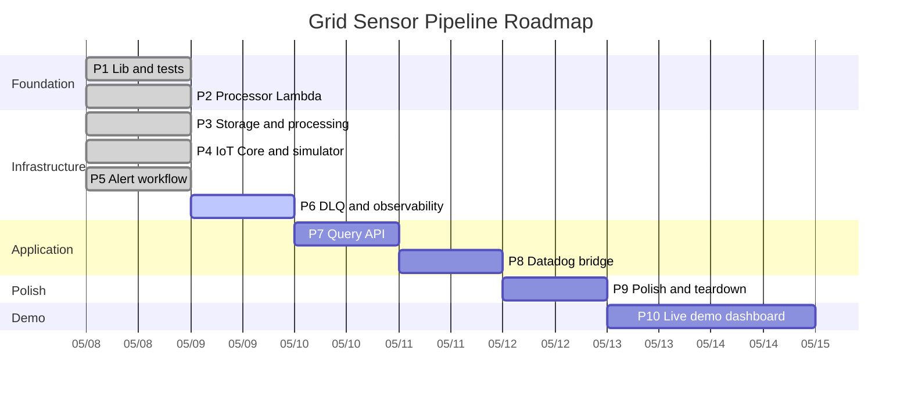

# Roadmap

Source of truth for the build sequence and current status. Updated at the end
of each phase. **Phases are units of work, not calendar days** — actual
elapsed time depends on focus and velocity.

---

## Status legend

| Symbol | Meaning |
|---|---|
| ✅ | Complete & verified |
| 🚧 | In progress |
| ⏭️ | Next up |
| ⏸️ | Blocked / paused |
| ⬜ | Not started |

---

## Current state

**Today:** Day 1 (2026-05-08)
**Active phase:** Phase 6 — DLQ + observability (next up)
**Last shipped:** Phase 5 — Alert workflow (deployed, 4-execution breach smoke test verified ✅)
**Cost reminder:** Run `npm run destroy` at the end of each dev session — Kinesis shard time accrues at ~$0.36/day.

---

## Progress

### Overall

```
[████████████░░░░░░░░] 61%   (31 / 51 sub-phases)
```

> Phase 5 closed end-to-end: 4 Step Functions executions started by
> simulator breach mode, all reaching `Alert notified` in the alert
> handler with bimodal breach distribution exactly as designed
> (sensor-002/003, frequency 59.092 Hz, voltage 109.876/111.25/129.411 V).
> Phase 6 (DLQ + observability) is the active phase.

### By phase

| # | Phase | Bar | % | Sub-phases | Status |
|---|---|---|---|---|---|
| 1 | Lib & test foundation        | `██████████` | 100% | 9/9 | ✅ |
| 2 | Processor Lambda             | `██████████` | 100% | 4/4 | ✅ |
| 3 | Storage + processing stacks  | `██████████` | 100% | 6/6 | ✅ |
| 4 | IoT Core + simulator         | `██████████` | 100% | 6/6 | ✅ |
| 5 | Alert workflow               | `██████████` | 100% | 6/6 | ✅ |
| 6 | DLQ + observability          | `░░░░░░░░░░` |   0% | 0/4 | ⏭️ |
| 7 | Query API                    | `░░░░░░░░░░` |   0% | 0/3 | ⬜ |
| 8 | Datadog bridge               | `░░░░░░░░░░` |   0% | 0/3 | ⬜ |
| 9 | Polish & teardown            | `░░░░░░░░░░` |   0% | 0/4 | ⬜ |
| 10 | Live demo dashboard         | `░░░░░░░░░░` |   0% | 0/6 | ⬜ |

### Gantt — phases on a timeline

GitHub renders this Mermaid block inline. For LinkedIn/decks, export with
`mmdc -i ROADMAP.md -o roadmap.png` or screenshot the rendered version.



### Phase × Requirements matrix

Maps each phase to the CLAUDE.md architectural invariants and hard rules it
satisfies. This is the requirements-alignment view: progress isn't just
"code shipped" — it's "contract clauses honored."

| Phase | Status | CLAUDE.md invariants satisfied | CLAUDE.md hard rules satisfied | Notes |
|---|---|---|---|---|
| P1 | ✅ | #2 (no I/O in `lib/`), #3 (`threshold.ts` is pure) | #1 (no `any`), #2 (no `console.log`), #3 (no bare `catch`), #4 (no hardcoded names) | Foundation that subsequent invariants are enforced against |
| P2 | ✅ | #1 (validate at I/O boundary), #4 (no business logic in handler), #5 (idempotency = Kinesis seq#), #7 (always `batchItemFailures`), #8 (metrics in `finally`) | #1, #2, #3, #4 (continued) | Six contract clauses honored in 195 lines |
| P3 | ✅ | #6 (`attribute_not_exists(pk)` enforced at write time, **proven via "Duplicate write swallowed" log entry on duplicate Kinesis put**), #9 (`bisectBatchOnError: true` on ESM, locked by template assertions, **proven via poison-pill → DLQ smoke test**) | #4 (resource names from CDK context), #5 (no `--require-approval never` until stable) | All deployed and smoke-tested end-to-end |
| P4 | 🚧 | #1 (validation continues at I/O boundary — simulator emits well-formed events that the processor's validator accepts) | #4 (resource names from CDK context) | Code shipped; deploy + smoke test pending. `ThresholdAlertRule` SQL will mirror `threshold.ts` (P5 wires it) |
| P5 | ✅ | #10 (Step Functions Standard for alerting, locked by template assertions, **proven via 4 Step Functions executions started by simulator breach mode, all reaching `Alert notified` with bimodal threshold distribution**) | — | Same predicate as `lib/threshold.ts` mirrored into IoT Rules SQL — keep in lockstep |
| P6 | ⬜ | — | — | Observability stack |
| P7 | ⬜ | #1 (validate at the API boundary too) | — | Read-only IAM |
| P8 | ⬜ | — | — | Pluggable observability via EMF |
| P9 | ⬜ | — | #6 (`cdk destroy --all` after dev sessions) | Final teardown verification |
| P10 | ⬜ | — | — | Demo surface only; reads existing metrics. Adds operational visibility for portfolio reviewers without changing pipeline contracts |

**Legend.** Invariants and rules numbered per `CLAUDE.md`. The matrix is
additive — once a clause is satisfied by an earlier phase, later phases
inherit and must not violate it.

## Notation

- **P<N>** — phase number (e.g., P2)
- **P<N>.<M>** — sub-phase within a phase (e.g., P1.2 = validator)
- **Day N (YYYY-MM-DD)** — calendar day reference in the daily log
- Each phase below numbers its sub-phases so the daily log can reference them
  precisely (`Day 3 (2026-05-10) — completed P2.1, started P2.2`).

---

## Phases at a glance

| # | Phase | Status | Primary deliverable | Decision log |
|---|---|---|---|---|
| 1 | Lib & test foundation | ✅ | Types · validator · threshold · repository · Powertools singletons · unit tests | [`docs/decisions/day-01-lib-foundation.md`](docs/decisions/day-01-lib-foundation.md) |
| 2 | Processor Lambda | ✅ | Kinesis ESM handler with Powertools idempotency, EMF metrics, partial-failure isolation | [`docs/decisions/phase-02-processor.md`](docs/decisions/phase-02-processor.md) |
| 3 | Storage + processing stacks | ✅ | CDK: Kinesis · DynamoDB · processor Lambda + ESM · DLQ — pipeline live | [`docs/decisions/phase-03-storage-processing.md`](docs/decisions/phase-03-storage-processing.md) |
| 4 | IoT Core + simulator | ✅ | IoT Rules: telemetry → Kinesis · simulator Lambda (threshold breaches deferred to P5) | [`docs/decisions/phase-04-iot-simulator.md`](docs/decisions/phase-04-iot-simulator.md) |
| 5 | Alert workflow | ✅ | Step Functions Standard: NotifyOps → Wait → IsAcknowledged → Escalate · alert-handler Lambda | [`docs/decisions/phase-05-alert-workflow.md`](docs/decisions/phase-05-alert-workflow.md) |
| 6 | DLQ + observability | ⬜ | DLQ inspector Lambda · CloudWatch dashboard · alarms (DLQ depth, P99, SF failures) | _pending_ |
| 7 | Query API | ⬜ | API Gateway + query Lambda · `GET /sensors/{id}/readings?from=&to=` | _pending_ |
| 8 | Datadog bridge | ⬜ | Datadog Lambda Extension layer wired (or design-doc-only if not deployed) | _pending_ |
| 9 | Polish & teardown | ⬜ | README revision · architecture diagram · cost analysis · `cdk destroy` verification | _pending_ |
| 10 | Live demo dashboard | ⬜ | CloudWatch (CDK, quick win) · Grafana (depth + Aireon experience callback) · simulator trigger button · portfolio embed | _pending_ |

---

## Phase 1 — Lib & test foundation ✅

**Goal.** Establish the typed I/O boundary, pure logic primitives, and the
DynamoDB abstraction with exhaustive unit tests. No infrastructure yet.

**Sub-phases & deliverables:**
- ✅ **P1.1** Domain types — `src/lib/types.ts` (`SensorEvent`, `SensorReading`, `AlertContext`, `ReadingType`)
- ✅ **P1.2** Validator — `src/lib/validator.ts` (Zod schema, `validateSensorEvent()`, strict, ISO 8601, sensorId regex)
- ✅ **P1.3** Threshold — `src/lib/threshold.ts` (pure `evaluateThreshold()`, NERC ±0.5 Hz / 120 V ±5 % defaults)
- ✅ **P1.4** Repository — `src/lib/repository.ts` (`SensorRepository`, `attribute_not_exists(pk)` writes, SK-range queries)
- ✅ **P1.5** Powertools singletons — `src/lib/{logger,tracer,metrics}.ts` under namespace `GridSensorPipeline`
- ✅ **P1.6** Unit tests — `src/__tests__/{validator,threshold,repository}.test.ts` (boundary matrix, mocked DocumentClient, purity assertions)
- ✅ **P1.7** Project scaffold — `package.json` (npm, Node ≥20), `tsconfig.json` (strict mode), `jest.config.js` (ts-jest), `eslint.config.mjs` (flat config), `.gitignore`
- ✅ **P1.8** Docs foundation — `docs/README.md`, `docs/review-checklist.md`, `docs/decisions/day-01-lib-foundation.md`, `docs/_private/interview-prep.md`
- ✅ **P1.9** Roadmap — `ROADMAP.md` (this file)

**Acceptance criteria:**
- [x] CLAUDE.md invariants 1-3 satisfied (validate at boundary, no I/O in lib, threshold is pure)
- [x] No `any`, no `console.log`, no bare `catch`
- [ ] `npm install && npm test && npm run build && npm run lint` clean on local machine

**Where to look:** [`docs/decisions/day-01-lib-foundation.md`](docs/decisions/day-01-lib-foundation.md), [`docs/review-checklist.md`](docs/review-checklist.md)

---

## Phase 2 — Processor Lambda ✅

**Goal.** Wire the Kinesis Event Source Mapping → handler → repository path
with idempotency, partial-failure isolation, and structured observability.

**Sub-phases & deliverables:**
- ✅ **P2.1** Processor handler — `src/handlers/processor.ts`
  - Decode Kinesis record → `validateSensorEvent()` → `repo.putReading()`
  - Wrapped: `tracer.captureLambdaHandler` + `logger.injectLambdaContext`
  - Per-record `makeIdempotent` keyed on `record.kinesis.sequenceNumber` via `eventKeyJmesPath`
  - Catches `ConditionalCheckFailedException` (by `err.name`) → no-op success
  - All other errors → `batchItemFailures` entry
  - EMF metrics: `EventsProcessed` + `ProcessingLatencyMs` (with `ReadingType` dimension via `metrics.singleMetric()`); `ValidationErrors`, `DuplicateWrites`, `PartialBatchFailures` on the shared instance
  - `metrics.publishStoredMetrics()` in `finally` (hard rule #8)
- ✅ **P2.2** Processor unit tests — `src/__tests__/processor.test.ts`
  - Happy path — full batch processed
  - Mixed batch — single bad record isolated
  - Full-failure batch — every record in `batchItemFailures`
  - Conditional swallow — `ConditionalCheckFailedException` returns success
  - Throttling does NOT get swallowed
  - Non-Error thrown values do NOT get swallowed
  - Mixed failure modes (validation + duplicate + throttle in one batch)
  - `isConditionalCheckFailed` helper unit tests (name match, similar names, non-Error values)
  - `IDEMPOTENCY_TTL_SECONDS` bounds check vs. Kinesis retention
- ✅ **P2.3** Decision log — `docs/decisions/phase-02-processor.md` (3 pre-flight decisions captured)
- ✅ **P2.4** Review checklist & interview-prep updates for Phase 2

**Acceptance criteria:**
- All processor test cases green
- Structured errors include sensorId or sequence number
- `metrics.publishStoredMetrics()` reachable on every code path

**Open decisions to resolve at start:**
1. Idempotency expiry window — recommend 24-26 h to match Kinesis retention
2. Conditional-failure swallow scope — recommend: only `ConditionalCheckFailedException` name match
3. `ReadingType` metric dimension — recommend: include (5 cardinality, cheap on CloudWatch)

---

## Phase 3 — Storage + processing CDK stacks ✅

**Goal.** First infrastructure phase. Stand up the storage and streaming
backbone, deploy the processor Lambda with the ESM, accept live events.

**Sub-phases & deliverables:**
- ✅ **P3.1** CDK app entrypoint — `infra/bin/app.ts`, `cdk.json`
- ✅ **P3.2** Storage stack — `infra/lib/storage-stack.ts` (readings table with `pk`/`sk`/TTL + GSI on `readingType + timestamp`, idempotency table)
- ✅ **P3.3** Kinesis stack — `infra/lib/kinesis-stack.ts` (Data Stream 1 shard / 24 h retention + Firehose → S3 cold archive with lifecycle IA→Glacier→expire; JSON+GZIP, Parquet deferred)
- ✅ **P3.4** Processing stack — `infra/lib/processing-stack.ts` (Processor Lambda · ESM with `bisectBatchOnError` + `reportBatchItemFailures` + retry=5 · SQS DLQ · IAM grants); CDK template assertions in `infra/__tests__/processing-stack.test.ts` lock the safety flags
- ✅ **P3.5** Bootstrap + first deploy — three stacks deployed (`GridSensorStorageStack`, `GridSensorKinesisStack`, `GridSensorProcessingStack`); four real-world snags surfaced and fixed in flight (see decision-log addendum below)
- ✅ **P3.6** Smoke test — Kinesis put-record → DynamoDB row verified, idempotent retry confirmed (`Duplicate write swallowed` log line), DLQ poison-pill confirmed (DLQ depth ≥ 1 after garbage payload)

**Acceptance criteria:**
- Full pipeline accepts a record from Kinesis to DynamoDB
- Idempotent retry verified (put twice, see one item)
- DLQ receives a deliberately invalid record after retries
- Cost teardown: `cdk destroy --all` removes all resources

**Dependencies:** Phase 2 complete.

---

## Phase 4 — IoT Core + simulator ✅

**Goal.** Replace the manual `put-record` with the real device path —
MQTT publish to IoT Core, Rules Engine routing to Kinesis and Step Functions.

**Sub-phases & deliverables:**
- ✅ **P4.1** IoT stack — `infra/lib/iot-stack.ts`
  - IoT data endpoint discovery via `AwsCustomResource`
  - IoT Rules role with inline `kinesis:PutRecord`/`PutRecords` policy
  - `AllTelemetryRule` — `SELECT *, topic(2) AS sensorId FROM 'sensors/+/telemetry'` → Kinesis (partition key `${sensorId}`)
  - Simulator Lambda (Node 20, 256 MB, X-Ray active) with `iot:Publish` scoped to `sensors/*/telemetry`
  - `ThresholdAlertRule` deferred to P5 (depends on Step Functions ARN)
  - Device certificates intentionally omitted (Fleet Provisioning is the prod path; simulator uses IAM auth via Data Plane SDK)
- ✅ **P4.2** Simulator handler — `src/handlers/simulator.ts` (Box-Muller Gaussian generator, 5-sensor pool, optional `--breach` mode, EMF metrics)
- ✅ **P4.3** Simulate script — `scripts/simulate.ts` (CLI driver: `--count`, `--breach`, `--function`, `--region`); `npm run simulate -- --count 50`
- ✅ **P4.4** Endpoint wiring — self-bootstrapping via `iot:DescribeEndpoint` custom resource at deploy time
- ✅ CDK template assertions — `infra/__tests__/iot-stack.test.ts` locks rule SQL, partition key, role policies, simulator IAM scope
- ✅ **P4.5** Deploy — `GridSensorIotStack` provisioned in account
- ✅ **P4.6** Smoke test — `npm run simulate -- --count 50` published 50 events; all reached DynamoDB through IoT → Kinesis → ESM → processor → repository path; breach mode tested (5 events, no failures)

**Acceptance criteria:**
- `npx ts-node scripts/simulate.ts --count 50` results in 50 items in DynamoDB
- IoT Rules SQL filter matches `threshold.ts` predicate exactly (cross-referenced)
- Threshold breach in simulator triggers a Step Functions execution

**Dependencies:** Phase 3 deployed; Phase 5 stack at least defined (alert state machine ARN must exist for the IoT rule to reference).

---

## Phase 5 — Alert workflow ✅

**Goal.** Auditable, long-running alert escalation backed by Step Functions
Standard.

**Sub-phases & deliverables:**
- ✅ **P5.1** Alert handler — `src/handlers/alert-handler.ts` (single Lambda for both NotifyOps and EscalateToOnCall, differentiated by `escalated: true` flag; reuses validator + threshold modules; per-record metric dimensioning via `singleMetric()`)
- ✅ **P5.2** Alert workflow stack — `infra/lib/alert-workflow-stack.ts` (Standard Workflow with `NotifyOps → WaitForAck → IsAcknowledged → AlertResolved | EscalateToOnCall → AlertResolved`; X-Ray active; ALL-level CloudWatch logging with execution data; 1-hour timeout; SNS topic with no subscriptions)
- ✅ **P5.3** IoT rule wiring — `infra/lib/iot-stack.ts` extended with conditional `ThresholdAlertRule` when `alertStateMachine` prop provided; conditional `StepFunctionsStart` inline policy on the IoT Rules role
- ✅ **P5.4** Cross-stack composition — `infra/bin/app.ts` instantiates `AlertWorkflowStack` before `IotStack`, passes state machine via constructor prop
- ✅ CDK template assertions — `infra/__tests__/alert-workflow-stack.test.ts` locks Standard type, X-Ray, ALL-level logging, runtime, env vars, SNS publish grant
- ✅ **P5.5** Deploy — `GridSensorAlertWorkflowStack` provisioned; `GridSensorIotStack` updated with `ThresholdAlertRule` + `StepFunctionsStart` inline policy. L2 interface drift fix landed (`stateMachineName` exposed as separate prop)
- ✅ **P5.6** Smoke test — `npm run simulate -- --count 5 --breach` started 4 Step Functions executions (4 breach readings of voltage/frequency out of 5 events; one was a non-thresholded readingType). Alert handler logs confirmed all 4 reaching `Alert notified` with bimodal distribution as designed (frequency 59.092 Hz, voltage 109.876/111.25/129.411 V across sensor-002 and sensor-003)

**Acceptance criteria:**
- Triggering a threshold breach via simulator runs the full state machine
- Execution history retained, viewable in console
- Mocked ack via SDK call resolves the workflow without escalation

**Dependencies:** Phase 4 IoT rule needs the state machine ARN.

---

## Phase 6 — DLQ + observability ⏭️

**Goal.** Production-grade visibility — dashboards, alarms, DLQ inspection.

**Sub-phases & deliverables:**
- ⬜ **P6.1** DLQ inspector — `src/handlers/dlq-inspector.ts`
  - SQS-triggered Lambda
  - Structured log with original Kinesis sequence number + error context
  - SNS alert
  - Optional Kinesis replay (env-flagged)
- ⬜ **P6.2** Observability stack — `infra/lib/observability-stack.ts`
  - CloudWatch Dashboard: `EventsProcessed`, `ProcessingLatencyMs` (p50/p95/p99), `ValidationErrors`, `DlqMessagesReceived`, Step Functions execution count + failures
- ⬜ **P6.3** Alarms — SNS-routed:
  - `GridSensor-DLQ-Messages` — DLQ depth ≥ 1
  - `GridSensor-P99-Latency` — p99 > 2000 ms for 3 min
  - `AlertWorkflow-Failures` — Step Functions ExecutionsFailed ≥ 1
- ⬜ **P6.4** Forced-failure verification — manually trigger each alarm path

**Acceptance criteria:**
- Dashboard renders with non-empty data after a simulator run
- Each alarm fires under a forced failure scenario
- DLQ inspector logs include enough context for debugging

**Dependencies:** Phase 5.

---

## Phase 7 — Query API ⬜

**Goal.** External read API surface over the readings table.

**Sub-phases & deliverables:**
- ⬜ **P7.1** Query handler — `src/handlers/query.ts`
  - `GET /sensors/{id}/readings?from=&to=&limit=`
  - Validates path/query params with Zod
  - Calls `repo.queryReadings()`
  - Returns 200 with array, 400 on bad input, 404 if sensor unknown
- ⬜ **P7.2** Query stack — `infra/lib/query-stack.ts`
  - API Gateway REST API
  - Lambda integration
  - IAM: read-only DynamoDB grant, no write permissions
- ⬜ **P7.3** Live curl verification against deployed endpoint

**Acceptance criteria:**
- `curl` against the deployed endpoint returns simulator-emitted readings
- Bad timestamps return 400
- Pagination via `Limit` is exposed (consider a cursor for future enhancement)

**Dependencies:** Phase 3.

---

## Phase 8 — Datadog bridge ⬜

**Goal.** Production observability path. Either deploy or document the
zero-app-code Datadog forwarding.

**Sub-phases & deliverables (deploy path):**
- ⬜ **P8.1** Datadog Lambda Extension layer ARN added to processor Lambda
- ⬜ **P8.2** `DD_API_KEY_SECRET_ARN`, `DD_SITE`, `DD_SERVERLESS_LOGS_ENABLED` env vars wired
- ⬜ **P8.3** Verification screenshot — same EMF metrics visible in Datadog

**Sub-phases & deliverables (design-doc path, if no Datadog account available):**
- ⬜ **P8.D1** `docs/decisions/phase-08-datadog-bridge.md` — full integration design
- ⬜ **P8.D2** README section showing the exact CDK code to add

**Acceptance criteria:**
- Either: metric visible in both CloudWatch and Datadog
- Or: design doc walks through the integration step-by-step with verification commands

**Dependencies:** Phase 6.

---

## Phase 9 — Polish & teardown ⬜

**Goal.** Make the repo presentable for portfolio/interview review.

**Sub-phases & deliverables:**
- ⬜ **P9.1** README revision — updated quickstart (post-deploy commands), architecture diagram (Mermaid or PNG), costs reconciled against actual dev-week spend
- ⬜ **P9.2** Decision-log index — chronological link list across `docs/decisions/`
- ⬜ **P9.3** Final scrub — `_private/` confirmed gitignored, no JD/recruiter notes in tracked files, history squash decision (fresh repo vs. `git filter-repo`)
- ⬜ **P9.4** Teardown verified — `cdk destroy --all` clean, no orphaned resources, no per-hour charges left running, AWS Cost Explorer confirmed

**Acceptance criteria:**
- A reviewer can clone, read README, and understand the architecture in 10 minutes
- All decision logs cross-link from the README
- Cost teardown confirmed by AWS Cost Explorer

---

## Phase 10 — Live demo dashboard ⬜

**Goal.** A single shareable URL that gives a portfolio reviewer the
"oh, neat" moment in under 30 seconds — live operational metrics
flowing in real time, with a button to trigger more events on demand.
CloudWatch first for the quick win; Grafana to demonstrate the data-
source flexibility used at Aireon.

**Sub-phases & deliverables:**
- ⬜ **P10.1** CloudWatch dashboard via CDK — `infra/lib/dashboard-stack.ts`:
  - Per-sensor latest reading widget (Logs Insights query into
    structured logs from the processor).
  - Pipeline throughput timeline (`EventsProcessed` count by minute).
  - Latency p50 / p95 / p99 from `ProcessingLatencyMs`.
  - DLQ depth gauge (current queue length).
  - Alert workflow execution count (will populate once Phase 5 ships).
  - Dimensioned by `ReadingType` so reviewers can see voltage vs.
    frequency vs. others side-by-side.
- ⬜ **P10.2** Public sharing of the CloudWatch dashboard — flip the
  "Share dashboard" toggle, capture the public URL, embed in the
  portfolio README. Document the toggle in the decision log; CDK
  doesn't natively manage this state (post-deploy CLI step).
- ⬜ **P10.3** Grafana decision log + setup — three options compared
  with cost lens:
  - **Amazon Managed Grafana** (~$9/active-user/mo, fully managed,
    easy SSO) — best if multiple reviewers will explore the dashboard
    interactively.
  - **Self-hosted Grafana on a t3.micro EC2** (~$8/mo + storage,
    full control) — good for portfolio if you want it always-on with
    a fixed cost.
  - **Local Grafana via Docker, screenshots embedded** (free, less
    interactive) — minimum cost, highest portfolio-permanence (can't
    accidentally let it expire).
  Decision goes in `docs/decisions/phase-10-demo-dashboard.md`.
- ⬜ **P10.4** Grafana dashboard build — CloudWatch as primary data
  source; optional Athena over the S3 cold archive for historical
  panels; same data shape as the CloudWatch dashboard plus richer
  per-sensor / per-zone visualizations Grafana supports natively.
- ⬜ **P10.5** Simulator trigger button — Lambda Function URL
  exposing a small static HTML page with a "Send 50 events" button
  (and a `--breach` checkbox). Calls the simulator Lambda directly so
  reviewers can drive new traffic without an AWS account or CLI.
- ⬜ **P10.6** Portfolio integration — link/embed both surfaces from
  the project README and the user's portfolio site. Optional: 30-second
  screen-recording GIF inline so the demo works even if the live
  surfaces are torn down.

**Acceptance criteria:**
- A reviewer opening the project README can reach a working dashboard
  in two clicks.
- Clicking "Send events" produces visible new data within ~10 seconds.
- Both CloudWatch and Grafana surfaces render the same core metrics
  consistently.
- Cost stays under $15/month even in the most-on configuration
  (Managed Grafana with active session) — and zero when torn down.

**Dependencies:**
- **Phase 6** (observability stack) provides the metrics both
  dashboards consume. Phase 10 won't be useful until Phase 6 ships
  the EMF metrics into CloudWatch.
- **Phase 7** (query API) is optional but useful for any client-side
  data fetches in a richer custom UI.
- **Phase 4** (simulator) is what the trigger button calls — already
  shipped.

**Why CloudWatch before Grafana:**
- **Quick wins.** CloudWatch dashboard via CDK is ~50 lines of
  construct code; live data appears immediately after deploy. Grafana
  setup involves either signing up for Managed Grafana, provisioning
  EC2, or running Docker locally — non-trivial.
- **Cost-aware.** First three CloudWatch dashboards are free per
  region; the project will have one in P6 + one in P10 = both free.
  Grafana costs accrue regardless of whether anyone's watching.
- **Sequential storytelling for the interview.** "I started with
  CloudWatch's native dashboards because they were the lowest-effort
  way to validate the metric design, then layered Grafana on top
  because the team I came from at Aireon used Grafana and the
  flexibility matters at scale." Both decisions defensible.

---

## Cross-cutting items

These run alongside the phases, not as a phase of their own.

- **Pre-share scrub.** Before the repo goes public: see Phase 9 final scrub checklist; consider squash-to-fresh-repo over history rewrite.
- **Decision-log discipline.** Every meaningful CDK or runtime choice → `docs/decisions/phase-NN-<short>.md` entry with **decision · alternatives · why this won · tradeoffs accepted**.
- **Review-checklist hygiene.** End of each phase: flip implemented items to `[x]`, add new open items under the next phase's section.
- **Interview-prep updates.** End of each phase: append a Q&A section to `docs/_private/interview-prep.md` for that phase's likely questions.
- **CLAUDE.md as immutable contract.** Architectural invariants and hard rules in `CLAUDE.md` are not negotiable mid-build. If a phase needs to violate one, document the deviation in the phase's decision log and update CLAUDE.md explicitly.

---

## Maintenance

This file is updated at the end of each working day:
1. Flip the sub-phase status symbols (✅) for what got finished.
2. If a phase is fully done, flip the phase symbol in the **Phases at a glance** table.
3. Update the **Progress** section:
   - Recompute the overall percentage (`done / total` sub-phases).
   - Update the per-phase bars (each `█` = 10% done; e.g., 4/4 = `██████████`, 2/4 = `█████░░░░░`).
   - Flip the corresponding row's status icon and counts.
   - In the Mermaid Gantt, change the phase's keyword (`active` → `done`) and start the next phase's bar with `:active`.
   - Update the Phase × Requirements matrix status column.
4. Move the "Active phase" pointer in **Current state** if it advanced.
5. Append an entry to the **Daily log** below.
6. Confirm any new decision log files are linked from the phase section.

### Daily log

Format: `**Day N** (YYYY-MM-DD) — completed P<N>.<M>: <brief summary>. Started P<N>.<M>: <brief summary>.`

- **Day 1** (2026-05-08) — completed **P1.1**–**P1.9** (full Phase 1) and
  **P2.1**–**P2.4** (full Phase 2).
  - **Phase 1:** domain types, Zod validator at the I/O boundary, pure
    threshold module, `SensorRepository` with conditional writes, three
    Powertools singletons, unit-test suites for validator/threshold/
    repository, npm/TS-strict/Jest/ESLint scaffold, docs foundation
    (`docs/README.md`, `docs/review-checklist.md`,
    `docs/decisions/day-01-lib-foundation.md`,
    `docs/_private/interview-prep.md`), and `ROADMAP.md`.
  - **Phase 2:** three pre-flight decisions captured with cost-lens
    annotations (idempotency expiry 24-26 h, conditional-error swallow
    scope strict, ReadingType metric dimension included);
    `src/handlers/processor.ts` with Powertools idempotency keyed on the
    Kinesis sequence number, per-record dimensioned EMF metrics via
    `metrics.singleMetric()`, and `batchItemFailures` partial-failure
    response; `src/__tests__/processor.test.ts` covering happy path,
    mixed-failure batches, conditional-swallow, throttle non-swallow,
    helper unit tests, and TTL bounds. Phase 2 decision log at
    `docs/decisions/phase-02-processor.md`; cost-awareness framing added
    to `docs/_private/interview-prep.md`.
  - **Phase 3 (✅ shipped end-to-end):** seven pre-flight decisions
    captured with cost-lens annotations (DynamoDB on-demand, Kinesis
    1-shard/24h, Firehose 5min/5MB GZIP, Lambda 512MB, ESM safety flags,
    DESTROY everywhere, three-stack composition); CDK app entrypoint +
    cdk.json; `infra/lib/storage-stack.ts`, `infra/lib/kinesis-stack.ts`,
    `infra/lib/processing-stack.ts`; CDK template assertions in
    `infra/__tests__/processing-stack.test.ts` (CLAUDE.md hard rule #9)
    and `infra/__tests__/kinesis-stack.test.ts` (Firehose role policy
    includes `kinesis:DescribeStream`); `cdk bootstrap` + `cdk deploy
    --all` succeeded; smoke tested all three paths (happy path, layered
    idempotency, poison-pill → DLQ). Four real-world deploy snags hit
    and fixed in-flight, captured in
    `docs/decisions/phase-03-storage-processing.md` "Deploy lessons"
    addendum: (1) IAM rejects non-ASCII characters in role descriptions,
    (2) `Stream.grantRead()` doesn't include the legacy
    `kinesis:DescribeStream`, (3) `addToPolicy` creates a separate IAM
    Policy resource that can race against dependent-resource creation —
    use `inlinePolicies` in role constructor instead, (4) CFN rollback
    silently leaks Kinesis streams under failed-deploy conditions.
  - **Cost teardown reminder:** ~$0.36/day Kinesis shard while deployed.
    `npm run destroy` at end of session.
  - **Phase 4 (✅ shipped end-to-end):** six pre-flight decisions
    captured; `infra/lib/iot-stack.ts` (endpoint discovery, Rules role
    with inline Kinesis policy, AllTelemetryRule, simulator Lambda with
    scoped iot:Publish); `src/handlers/simulator.ts` (Gaussian payload
    generator, breach mode, EMF metrics); `scripts/simulate.ts`;
    `infra/__tests__/iot-stack.test.ts`; learning note
    `docs/learning/aws-iot-core.md` and new
    `docs/learning/synthetic-data-and-simulation.md` filled.
    Deployed and smoke-tested: 50 events published in 1.5 s, all
    landed in DynamoDB through IoT → Kinesis → ESM → processor.
    `Duplicate write swallowed` log line verified P2's
    `attribute_not_exists(pk)` path on a duplicate Kinesis put.
  - **Phase 5 (✅ shipped end-to-end):** six pre-flight decisions
    captured; `src/handlers/alert-handler.ts` (single Lambda for
    NotifyOps and EscalateToOnCall, reuses validator + threshold);
    `infra/lib/alert-workflow-stack.ts` (Standard Workflow, X-Ray on,
    ALL-level CloudWatch logging, configurable wait);
    `infra/lib/iot-stack.ts` extended with conditional
    `ThresholdAlertRule` and `StepFunctionsStart` inline policy;
    `infra/__tests__/alert-workflow-stack.test.ts`; Step Functions
    learning note + new `cdk-as-typed-model.md` learning note (CDK's
    defining property as "single typed model spanning runtime + infra"
    with pitfalls including the L2 interface drift we hit).
    Deployed and smoke-tested: 4 Step Functions executions started by
    simulator breach mode, all reaching `Alert notified` in the alert
    handler. Bimodal Gaussian distribution worked exactly as designed
    in `synthetic-data-and-simulation.md`: frequency 59.092 Hz (below
    min); voltage 109.876, 111.25 V (below min) and 129.411 V (above
    max). One additional discovery: `IStateMachine.stateMachineName`
    was removed from the interface in newer aws-cdk-lib (only on
    concrete `StateMachine` class) — fixed by exposing
    `stateMachineName` as a separate `public readonly string` field on
    `AlertWorkflowStack`. Pattern captured in
    `docs/learning/cdk-as-typed-model.md` pitfall table for next
    interface-drift situation.
