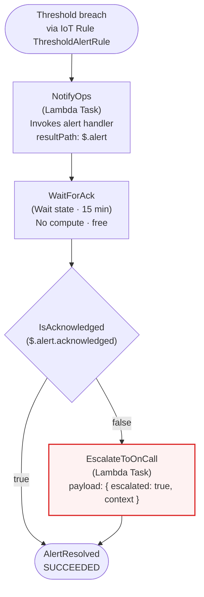
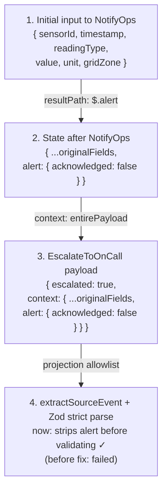

# Alert Workflow (Step Functions State Machine)

> [ ↩ Back to System Overview ](./system-overview.md)

> The alert workflow is a Step Functions Standard Workflow — five
> states, three of which do real work, two that are routing/terminal.
> Standard mode (not Express) because we need a 15-minute Wait state
> and 90-day audit history for safety-critical grid alerts.
> Architecturally interesting: state grows through the workflow, and a
> shape mismatch between Step Functions' resultPath and the alert
> handler's strict validator created issue #1.

## State machine

## State shape transformation (where the bug lived)

The state object grows at each step. This is the architectural detail
that produced the [issue #1 regression](https://github.com/amusto/Grid-Sensor-Pipeline/issues/1):

## What's interesting about this view

> - **Why Standard, not Express.** Express can't do a 15-minute Wait
>   (max 5) and only retains 1 hour of history. Standard gives free
>   Wait + 90-day audit at ~10× the per-execution cost. The cost framing
>   isn't per state transition — it's per missed audit.
> - **The Wait state is the killer feature.** A naïve "wait for ack"
>   would invoke Lambda every N seconds to poll. The Wait state happens
>   at the AWS-managed scheduler level — no compute runs for those 15
>   minutes. Lambda can't economically wait that long; Step Functions
>   can.
> - **One Lambda for both NotifyOps and EscalateToOnCall.** Differentiated
>   by an `escalated: true` flag. Composition over duplication —
>   two near-identical Lambdas would mean two deploy units, two log groups,
>   two IAM grants for the same operation.
> - **State-shape mismatch produced issue #1.** Step Functions' resultPath
>   appended `alert.acknowledged` to the state; the alert handler's
>   `.strict()` Zod validator rejected the unknown key on the escalation
>   invocation. Bug lived at the integration point between two correctly-
>   configured systems. Fixed by explicit allowlist projection in
>   `extractSourceEvent`.

## Related

- Decision log: [`../decisions/phase-05-alert-workflow.md`](../decisions/phase-05-alert-workflow.md) — the original Step Functions design.
- Issue: [#1 — Alert workflow escalation path fails Zod validation due to state-shape mismatch](https://github.com/amusto/Grid-Sensor-Pipeline/issues/1)
- Drill in further: [LangGraph flow](./langgraph-flow.md) — what the alert handler does inside the NotifyOps task.
