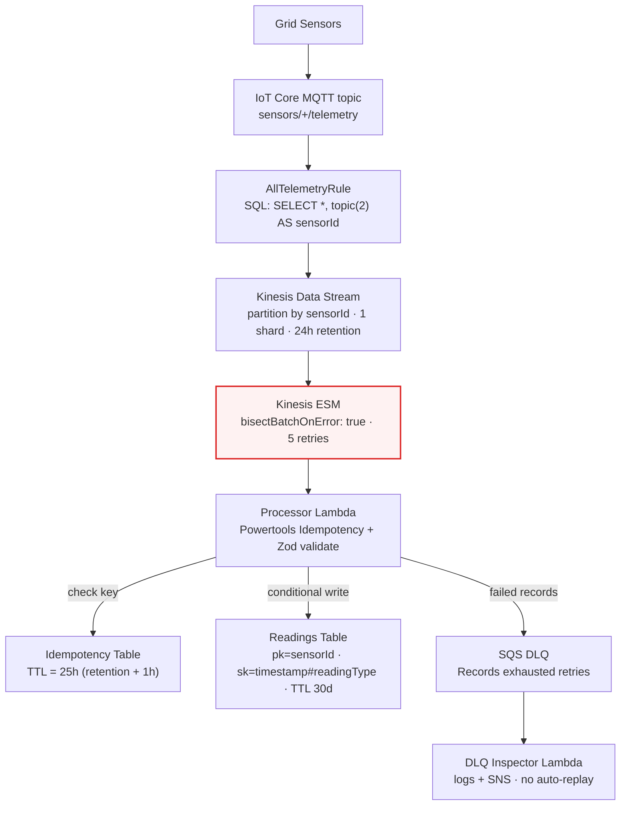

# Data Ingestion Path

> [ ↩ Back to System Overview ](./system-overview.md)

> **[ FILL IN — 2-3 sentences in your voice. Suggested direction:
> "The path every sensor reading takes from the device to durable
> storage. This is the high-volume side of the pipeline — every
> reading flows through here, regardless of whether it triggers an
> alert. The architecturally interesting parts are the partial-batch-
> failure handling at the Kinesis ESM layer and the two-tier
> idempotency pattern at the DynamoDB write layer." ]**

## What's interesting about this view

> **[ FILL IN — 3-5 sentences. Suggested angles:
>
> - **`bisectBatchOnError: true` (highlighted in red).** Without it, one
>   poison record in a 100-record batch fails the entire batch on every
>   retry — losing throughput on 99 records to chase 1. With it, Kinesis
>   bisects on failure to isolate the bad record in O(log n) retries.
>   The most operationally important setting on the entire ingestion path.
> - **Two-tier idempotency.** Powertools Idempotency at the Lambda layer
>   (keyed on the Kinesis sequence number, persisted in its own table
>   with TTL = stream retention + safety margin) PLUS a
>   `ConditionExpression: attribute_not_exists(pk)` on every DynamoDB
>   write. Belt-and-suspenders against retry-induced duplicates.
> - **DLQ is deliberately non-auto-replaying.** When a record exhausts
>   the retry budget, it's a poison pill — replaying it without human
>   inspection turns the poison into an infinite-cost retry storm. The
>   inspector logs + alerts; replay is an explicit env-flag opt-in.
> - **Validate at the I/O boundary.** Zod parses raw decoded JSON into a
>   typed `SensorEvent`; downstream lib code receives the typed value,
>   never `unknown`. Schema is the source of truth for both runtime
>   validation and TypeScript types. ]**

## Related

- Decision log: [`../decisions/phase-02-processor.md`](../decisions/phase-02-processor.md) — the idempotency + partial-batch-failure design.
- Decision log: [`../decisions/phase-03-storage-processing.md`](../decisions/phase-03-storage-processing.md) — the storage stack + deploy lessons (Kinesis CFN orphan, IAM ordering).
- Decision log: [`../decisions/phase-06-dlq-observability.md`](../decisions/phase-06-dlq-observability.md) — the DLQ inspector pattern.
