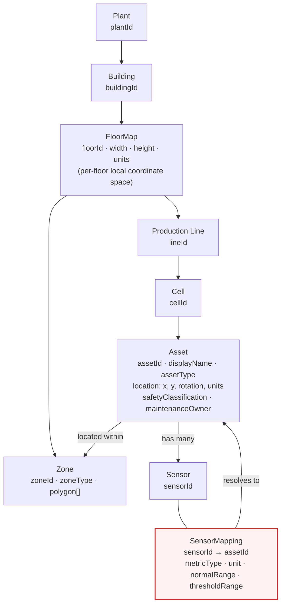

# Factory Floor Context (Domain Model)

> [ ↩ Back to System Overview ](./system-overview.md)

> Phase 15 maps abstract sensor telemetry to physical factory-floor
> assets and their spatial context. This diagram shows the domain
> model — how a `Plant` decomposes into buildings, floors, lines, and
> cells, and how `Asset`, `Zone`, and `SensorMapping` relate so a bare
> `sensorId` can be resolved to a real location. All of this is
> deterministic reference data: the LLM never participates in
> producing it.

## The asset / location domain

> The red-bordered box is the join that makes the whole feature work:
> `SensorMapping` is the deterministic link from the telemetry world
> (`sensorId`) to the physical world (`assetId` → location → zone).

## What's interesting about this view

- **Per-floor local coordinate space, not GPS.** Each `FloorMap` is its
  own Cartesian space (`width`, `height`, `units`, origin); an `Asset`'s
  `location: {x, y, rotation}` is meaningful only within its floor.
  This is the indoor adaptation of the ERIP GPS/GIS model — lat/long
  has no shop-floor meaning, so location is always
  `(plantId, buildingId, floorId)` + local `(x, y)`.
- **`SensorMapping` is the single source of truth for sensor→asset.**
  One sensor maps to exactly one asset; an asset can carry many
  sensors. The mapping also carries the metric contract
  (`metricType`, `unit`, `normalRange`, `thresholdRange`) so the
  registry knows what "normal" means per sensor.
- **Zones are polygons, assets are points.** An asset sits *within* a
  zone (point-in-polygon, conceptually), so a thermal event on
  Conveyor 02 can be attributed to "Zone Line-1 Cell-A" for routing a
  response — without any model inference.
- **All reference data, all deterministic.** Plant/building/floor/line/
  cell/zone/asset/mapping are static seed data
  (`data/factory-floor/*.json`). The enrichment service reads them; the
  LLM layer never writes them. See
  [`../decisions/phase-15-factory-floor-mapping.md`](../decisions/phase-15-factory-floor-mapping.md)
  pre-flight 1.

## Related

- Drill in next: [Location enrichment flow](./location-enrichment-flow.md) — how a telemetry event is enriched with this context at runtime.
- Decision log: [`../decisions/phase-15-factory-floor-mapping.md`](../decisions/phase-15-factory-floor-mapping.md) — the six pre-flight decisions, including the deterministic-mapping principle.
- Operations: [`../operations/asset-registry-runbook.md`](../operations/asset-registry-runbook.md) — how to inspect and update the registry seed data.
