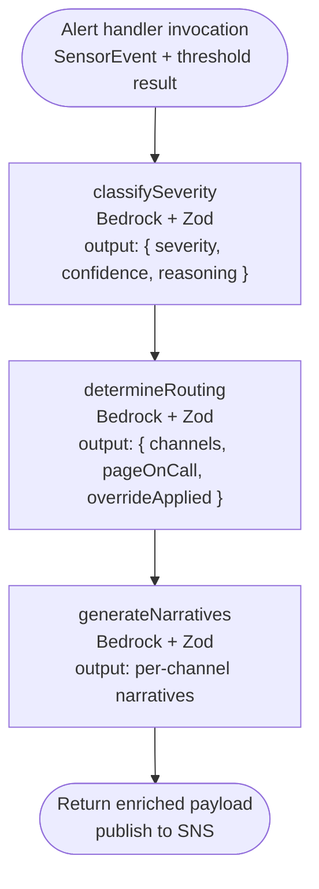
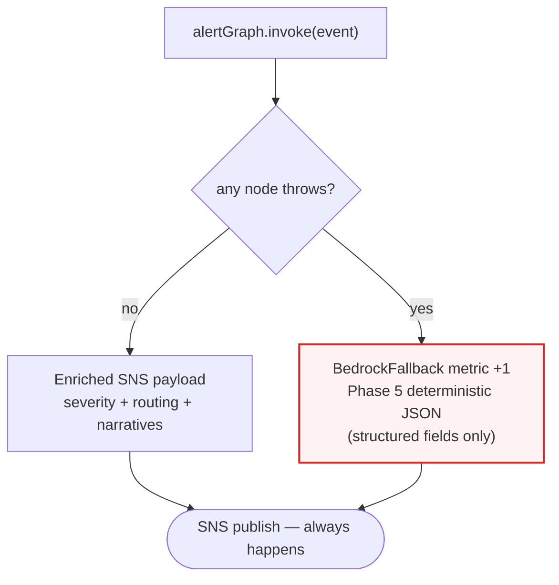
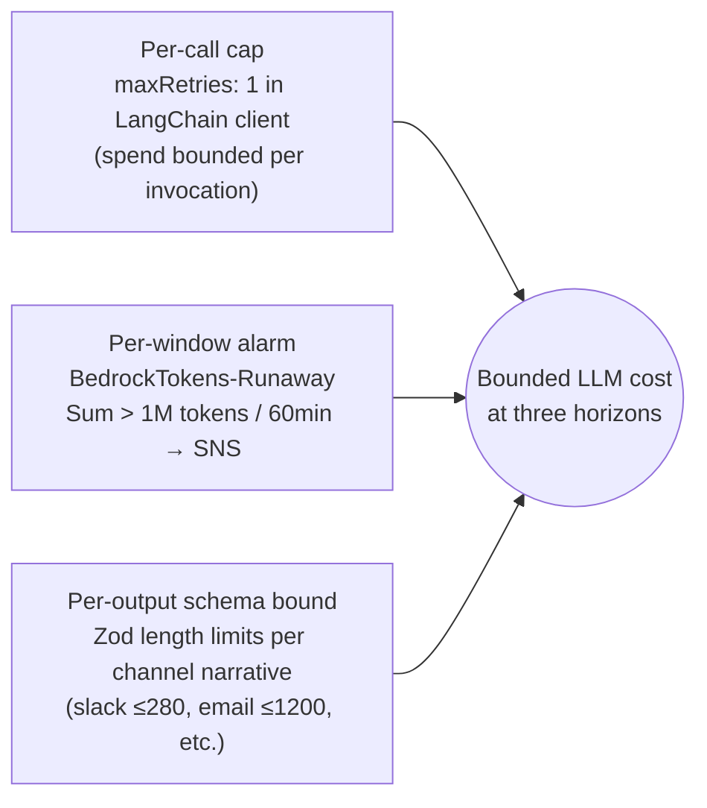

# LangGraph Flow (Inside the Alert Handler)

> [ ↩ Back to System Overview ](./system-overview.md)

> Inside the alert handler Lambda, a three-node LangGraph state
> machine runs over Bedrock Claude Sonnet 4.6. Each node is a plain
> async function that uses Zod-typed structured output. The graph
> assembly is mechanical; the architectural decisions worth noticing
> are the layer separation (Step Functions outer + LangGraph inner)
> and the fail-soft fallback (AI is best-effort, never load-bearing).

## The three-node graph

## Fail-soft fallback

## What's interesting about this view

> - **Step Functions outer + LangGraph inner.** Step Functions for the
>   durable workflow (audit + Wait + retry across long timescales);
>   LangGraph for the agentic decisioning inside one Lambda invocation
>   (low-latency, ephemeral, multi-LLM-call). Composition at different
>   layers — each at the layer where it's strongest.
> - **Each node is a plain async function.** No special LangGraph
>   plumbing inside the nodes; they wrap calls to `invokeStructured`
>   from `lib/llm-client.ts`. Easy to unit-test in isolation; LangGraph
>   only does the orchestration.
> - **Zod-typed structured output.** Every LLM call returns a parsed,
>   validated object. Schema bounds (severity enum, confidence in [0,1],
>   reasoning length 10-500 chars) act simultaneously as type contract,
>   runtime check, and *cost lever* (length bounds cap output tokens).
> - **Fail-soft is the load-bearing pattern.** If any node throws
>   (Bedrock error, parse failure, schema violation), the handler
>   increments `BedrockFallback` and emits Phase 5's deterministic JSON
>   payload. The alert ALWAYS reaches SNS. AI-generated content is a
>   quality improvement, not a precondition for notification.

## Cost guardrails at three time horizons

## Related

- Decision log: [`../decisions/phase-08-ai-ml-integration.md`](../decisions/phase-08-ai-ml-integration.md) — the seven pre-flight decisions plus the Anthropic use-case-gate deploy lesson.
- Learning note: [`../learning/langchain-langgraph.md`](../learning/langchain-langgraph.md) — primitives, pitfalls, interview framing.
- Drill in next: [MCP server](./mcp-server.md) — how the same data is exposed to external LLM agents as read-only tools.
