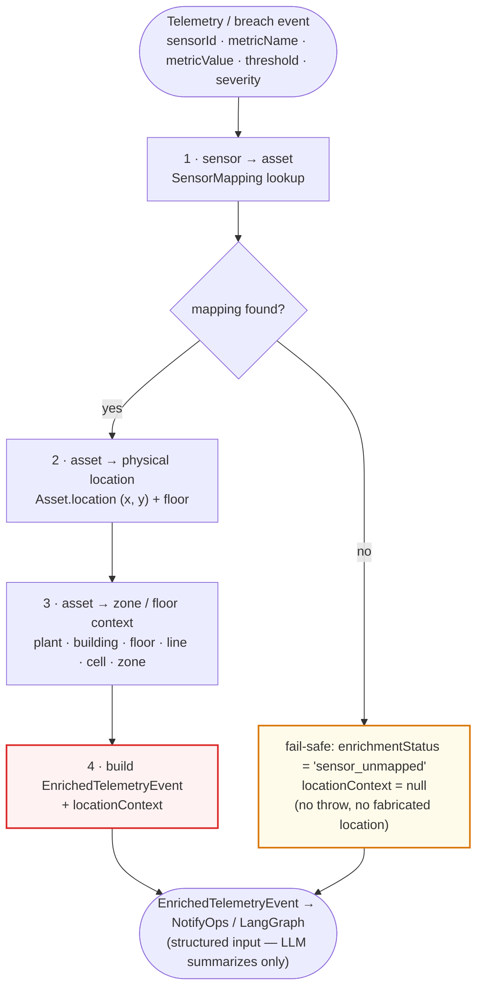
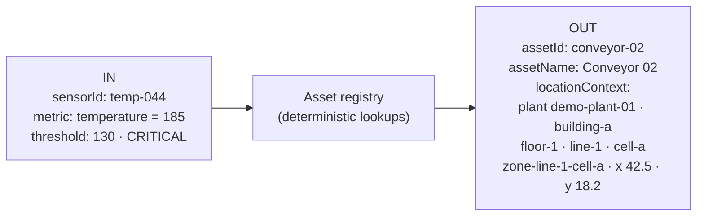

# Location Enrichment Flow

> [ ↩ Back to System Overview ](./system-overview.md)

> Phase 15 inserts a deterministic enrichment step between threshold
> evaluation and the alert/NotifyOps response. Given a telemetry event
> with a `sensorId`, the enrichment service resolves the asset, its
> physical location, and its zone, then produces an
> `EnrichedTelemetryEvent` with a structured `locationContext`. No LLM
> call happens anywhere in this path — the model only sees the
> already-enriched output downstream.

## The enrichment pipeline

## Worked example

## What's interesting about this view

- **Deterministic by construction.** Steps 1–4 are in-memory lookups
  against versioned seed data — no Bedrock, no network, no inference.
  This is the load-bearing principle of Phase 15: location facts come
  from data, not a model
  ([decision log pre-flight 1](../decisions/phase-15-factory-floor-mapping.md)).
- **Fail-safe over fail-fast (the amber box).** An unmapped `sensorId`
  does not throw and does not invent a location. It returns a structured
  `enrichmentStatus` with `locationContext: null` so the alert still
  fires with an honest "location unknown." A confidently-wrong location
  is more dangerous than an admitted-unknown one — especially when it
  dispatches a person to the wrong cell during a thermal event.
- **Enrichment is additive.** The `EnrichedTelemetryEvent` carries the
  breach fields the NotifyOps/LangGraph layer already expects *plus* the
  nested `locationContext`. The ingest `SensorEvent` / `AlertContext`
  contracts are untouched — this is a new downstream type, not a mutation.
- **The LLM is strictly downstream and read-only on location.** Phase
  8/9's LangGraph receives the enriched context as structured input. It
  may write *prose* about the location ("Conveyor 02 on Line 1 is
  overheating; nearest response zone is Cell A"); it never writes the
  location itself. Fail-soft AI stays intact — if Bedrock is down, the
  alert still carries correct location context.

## Related

- Domain model: [Factory floor context](./factory-floor-context.md) — the asset/zone/mapping types this flow reads.
- Decision log: [`../decisions/phase-15-factory-floor-mapping.md`](../decisions/phase-15-factory-floor-mapping.md) — deterministic-mapping principle + missing-mapping fail-safe.
- LangGraph flow: [`./langgraph-flow.md`](./langgraph-flow.md) — the downstream consumer of the enriched context.
