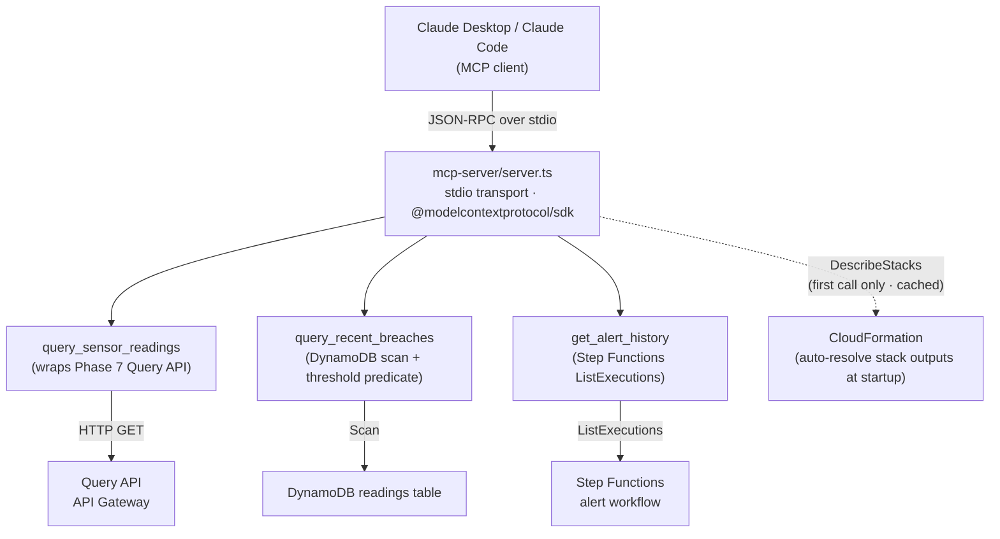

# MCP Server

> [ ↩ Back to System Overview ](./system-overview.md)

> **[ FILL IN — 2-3 sentences in your voice. Suggested direction:
> "A local stdio-transport MCP server exposing three read-only tools
> over the deployed pipeline. Any MCP-aware LLM client (Claude
> Desktop, Claude Code, custom agents) can connect to it and ask
> natural-language questions about pipeline state. This demonstrates
> the system's data API as a platform interface — not just an internal
> contract, but a callable surface that external tooling builds on." ]**

## What's interesting about this view

> **[ FILL IN — 3-5 sentences. Suggested angles:
>
> - **MCP demonstrates platform thinking.** The pipeline's read API is
>   already exposed via API Gateway, DynamoDB, and Step Functions —
>   but only to AWS-aware callers. The MCP server turns those same
>   surfaces into LLM-callable tools. The system becomes a platform
>   that other agents build on, not just an internal pipeline.
> - **All three tools are read-only — deliberately.** Write tools
>   (case management, alert acknowledgment) ship at Phase 9 with a
>   separate idempotency layer. The read-only set keeps the protocol
>   surface safe for any client to invoke without consequence.
> - **Stdio transport for the POC.** Claude Desktop and Claude Code
>   both connect to local stdio MCP servers via JSON config — zero
>   hosting infrastructure. Production migration path is HTTP/SSE
>   behind API Gateway with auth.
> - **CloudFormation-driven auto-config.** The server resolves the
>   Query API URL and Alert state machine ARN from CFN stack outputs
>   at first tool invocation. Users don't need to manage env vars
>   manually — the server reads its own infrastructure. Cached for
>   the server's lifetime. ]**

## Verified live

The three tools have been exercised against the deployed pipeline
during testing. A single `query_recent_breaches` call returned 21
real breach records from DynamoDB — production-shape data, real
auth chain, real protocol framing.

## Related

- Decision log: [`../decisions/phase-08-ai-ml-integration.md`](../decisions/phase-08-ai-ml-integration.md) pre-flight 5 — why MCP, why stdio, why these three tools.
- Source: [`../../mcp-server/server.ts`](../../mcp-server/server.ts) — ~340 lines including the auto-config logic.
- Setup guide: [`../../mcp-server/README.md`](../../mcp-server/README.md) — Claude Desktop and Claude Code config stanzas, env vars, troubleshooting.
