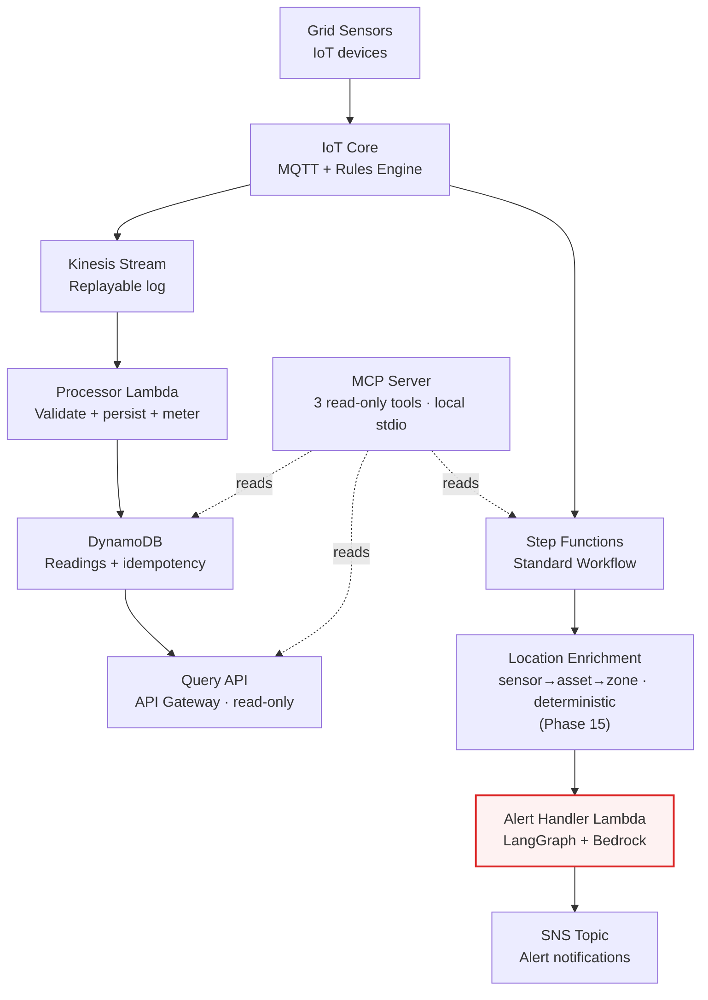

# System Overview

Flagship project demonstrating common architectural patterns in serverless
systems. Using IoT Core, Kinesis, Step Functions, Bedrock, and LangGraph at the application layer,
then built a serverless pipeline that ingests sensor telemetry from a grid of IoT devices,
validates it, persists it, and alerts on any anomalous readings.

My focus was to lead with the architectural shape, not the feature list.

"Serverless IoT event-processing pipeline built end-to-end in
TypeScript. Sensor telemetry flows through IoT Core into a Kinesis-fed
persistence path and, in parallel, through a Step Functions workflow
that uses Bedrock to enrich alert notifications. An MCP server exposes
the pipeline's data to LLM agents as read-only tools. This diagram is
the entry point — click any box to drill into that subsystem."

> Solid arrows: production data flow. Dashed arrows: read-only access.
> The red-bordered box is where the LangGraph + Bedrock integration
> lives — the most architecturally distinctive part of the system.

## What's interesting about this view

Delivered a Hybrid of Serverless and Serverless-as-a-Service.

**Hybrid Step Functions + LangGraph composition.** Two workflow
technologies, each at the layer where it's strongest 
— Step Functions for the durable outer workflow (15-minute Wait state, 90-day audit trail) and LangGraph for the agentic 
inner flow inside one Lambda invocation. Composition over replacement. 

**Two parallel paths from the same source event.** 
IoT Core fans out to both Kinesis (durable archive processor path) and Step Functions (alert path). The data persistence path doesn't block alerts; the alert path doesn't block storage. Decoupled failure domains.
 
**Validate at the I/O boundary, everywhere.** 
Zod parse-don't-validate at every external input — IoT-decoded events at the Kinesis processor, query parameters at the API Gateway, LLM outputs from Bedrock.

Downstream code receives typed values, never `unknown`.

**MCP server as a platform interface.** The pipeline's data is exposed to any MCP-aware LLM client as three read-only tools, demonstrating that the system's data API is a platform contract, not just an
internal abstraction.**

## Click any box above to drill in

- [Data ingestion path](./data-ingestion-path.md) — IoT → Kinesis → Processor → DynamoDB
- [Alert workflow](./alert-workflow.md) — the Step Functions state machine
- [LangGraph flow](./langgraph-flow.md) — the three-node graph inside the alert handler
- [MCP server](./mcp-server.md) — local stdio MCP server with three read-only tools
- [Factory floor context](./factory-floor-context.md) — Phase 15 asset/location domain model
- [Location enrichment flow](./location-enrichment-flow.md) — Phase 15 deterministic sensor→asset→zone enrichment

## Related

- Decision logs live in [`../decisions/`](../decisions/) — one per phase, with the trade-offs we accepted at each step.
- The full roadmap with daily log entries is at [`../../ROADMAP.md`](../../ROADMAP.md).
