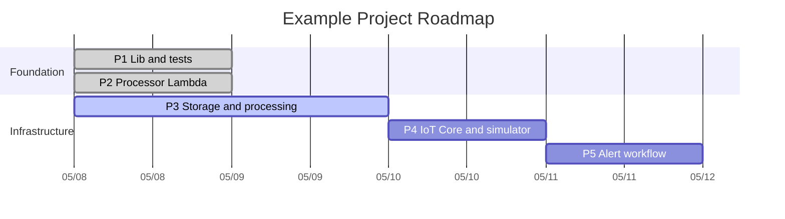

# Feature Spec — Roadmap → Mermaid Gantt Export

> **For Claude Code:** This is a self-contained specification. You don't
> need any context outside this document. It was drafted in a different
> project (an AWS infrastructure POC) where a Mermaid Gantt chart was
> hand-built — that experience surfaced the gotchas captured here. Apply
> them directly to the user's existing roadmap codebase.

---

## Step 0 — Clarify before implementing

Use `AskUserQuestion` to resolve these *before* writing any code. The
spec assumes nothing about the user's stack or storage layer.

1. **Domain model** — what fields does an existing "phase" / "milestone" /
   "epic" record have today? (id, title, status, start, end/duration,
   dependencies, section/category, assignee, etc.)
2. **Storage** — where does roadmap data live? (Postgres, SQLite, JSON file,
   in-memory store, third-party API like Linear/Notion?)
3. **Frontend stack** — React, Next.js, Vue, Svelte, plain HTML?
4. **Where should the export surface?**
   - Button in the UI?
   - CLI command (`npm run export-mermaid`)?
   - API endpoint (`GET /api/roadmaps/:id/export.md`)?
   - All three?
5. **Output delivery preference** (one or more):
   - Copy to clipboard
   - Download as `.md` file
   - Inline live preview using mermaid.js
   - Print-to-stdout (for CLI mode)
6. **Status vocabulary** — what statuses does the app already use?
   (Some apps use `todo / in_progress / done`, some use `not_started /
   active / completed / blocked`. The Mermaid Gantt only natively supports
   three: `done`, `active`, pending.)

Pause for answers before moving on. Don't assume.

---

## Context: what the user wants

The user maintains a roadmap in their app today. They saw a working
Gantt chart embedded in a README of another project that showed phases
on a timeline with sections, status indicators (done/active/pending),
and dependency arrows — and they want to generate that same chart from
their app's data.

The chart looks like this when rendered (e.g., on GitHub markdown):



The export feature turns the user's data into that block.

---

## Acceptance criteria (what "done" looks like)

- [ ] User can trigger an export through whichever surface they chose
  (UI button / CLI / API).
- [ ] Output is **valid Mermaid Gantt syntax** that renders correctly on:
  - GitHub markdown blocks
  - https://mermaid.live
  - The user's own inline preview, if (c) is in scope
- [ ] Output **handles all known Mermaid Gantt fragility** (see Gotchas
  section below).
- [ ] Edge cases are handled with clear error messages, not opaque
  failures:
  - Empty roadmap
  - Phase with neither `startDate` nor `dependsOn`
  - Cyclic dependencies (`P1 → P2 → P1`)
  - Status values not in the supported set
- [ ] Unit tests cover the transform's output shape and the gotchas list.
- [ ] At least one integration / smoke test renders the output through
  mermaid.js in a headless environment to confirm parseability.

---

## The data model the export consumes

Define this normalized shape — your **adapter** maps the app's actual
domain model into this. Don't pollute the domain model with these names.

```ts
export type PhaseStatus = 'done' | 'active' | 'pending';

export interface Phase {
  /** Stable identifier — used as Mermaid task id and for `dependsOn` references. */
  id: string;
  /** Human-readable label shown on the chart. */
  title: string;
  /** Section heading the phase belongs to (e.g., "Q1 Goals", "Foundation"). */
  section: string;
  /** Lifecycle status — only three values are supported by Mermaid Gantt. */
  status: PhaseStatus;
  /** ISO date `YYYY-MM-DD`. Required if `dependsOn` is not set. */
  startDate?: string;
  /** Duration in Mermaid syntax (`1d`, `3w`, `2h`). Required. */
  duration: string;
  /** Another `Phase.id` — emits `after <id>` clause instead of `startDate`. */
  dependsOn?: string;
}

export interface RoadmapExportOptions {
  /** Chart title shown above the Gantt. */
  title: string;
  /** Mermaid `dateFormat` directive. Default: `YYYY-MM-DD`. */
  dateFormat?: string;
  /** Mermaid `axisFormat` directive. Default: `%m/%d`. */
  axisFormat?: string;
}
```

### Adapter pattern

The user's domain model probably has additional fields (`assignee`,
`percent_complete`, `priority`, `description`, `tags`, etc.). Those don't
go into the Gantt output. Write a thin adapter that knows the user's
domain model and produces `Phase[]`:

```ts
// Example — adjust to whatever domain model the user actually has
import type { ProjectMilestone } from '../db/types';
import type { Phase, PhaseStatus } from './types';

const mapStatus = (m: ProjectMilestone): PhaseStatus => {
  if (m.completedAt) return 'done';
  if (m.startedAt) return 'active';
  return 'pending';
};

export const milestoneToPhase = (m: ProjectMilestone): Phase => ({
  id: m.id,
  title: m.title,
  section: m.epic ?? 'Uncategorized',
  status: mapStatus(m),
  startDate: m.targetStart ?? undefined,
  duration: `${m.estimatedDays}d`,
  dependsOn: m.blockedBy?.[0],   // Mermaid only supports single dep per task
});
```

---

## Reference implementation — the transform

This is the entire transform. Drop it in, write tests against it,
extend the adapter. ~30 lines of pure functional logic.

```ts
import type { Phase, RoadmapExportOptions } from './types';

/**
 * Sanitize strings for Mermaid Gantt parser fragility.
 *
 * Replaces characters that break parsing on GitHub's renderer
 * (em-dash, en-dash) and characters that some Mermaid versions
 * mishandle inside task labels (`&`, `+`).
 */
const sanitize = (s: string): string =>
  s.replace(/&/g, 'and')
   .replace(/\+/g, 'and')
   .replace(/[—–]/g, '-');

/**
 * Generate a Mermaid Gantt block from a list of phases.
 *
 * Tasks within a section are emitted in the order they appear in the
 * input array. If you want a specific ordering, sort `phases` before
 * calling.
 */
export function generateMermaidGantt(
  phases: Phase[],
  opts: RoadmapExportOptions,
): string {
  if (phases.length === 0) {
    throw new Error('Cannot generate a Gantt chart from zero phases');
  }

  // Validate every phase has either startDate or dependsOn
  const invalid = phases.filter(p => !p.startDate && !p.dependsOn);
  if (invalid.length > 0) {
    throw new Error(
      `Phases missing both startDate and dependsOn: ${invalid.map(p => p.id).join(', ')}`,
    );
  }

  const lines = [
    'gantt',
    `    title ${sanitize(opts.title)}`,
    `    dateFormat ${opts.dateFormat ?? 'YYYY-MM-DD'}`,
    `    axisFormat ${opts.axisFormat ?? '%m/%d'}`,
  ];

  // Group by section, preserving insertion order
  const bySection = new Map<string, Phase[]>();
  for (const p of phases) {
    const arr = bySection.get(p.section) ?? [];
    arr.push(p);
    bySection.set(p.section, arr);
  }

  for (const [section, sectionPhases] of bySection) {
    lines.push(`    section ${sanitize(section)}`);
    for (const p of sectionPhases) {
      const statusKw = p.status === 'pending' ? '' : p.status;
      const start = p.dependsOn
        ? `after ${p.dependsOn.toLowerCase()}`
        : p.startDate;
      const label = sanitize(`${p.id} ${p.title}`).padEnd(30);
      lines.push(
        `    ${label}:${statusKw.padEnd(7)}, ${p.id.toLowerCase()}, ${start}, ${p.duration}`,
      );
    }
  }

  return lines.join('\n');
}

/**
 * Wrap the Gantt in a fenced markdown code block — handy for download
 * or for embedding in a README.
 */
export function exportMermaidMarkdown(
  phases: Phase[],
  opts: RoadmapExportOptions,
): string {
  const gantt = generateMermaidGantt(phases, opts);
  return `\`\`\`mermaid\n${gantt}\n\`\`\`\n`;
}
```

---

## Cycle detection helper

Mermaid will give you an opaque error on a dependency cycle. Detect it
upfront with a clearer message:

```ts
import type { Phase } from './types';

/**
 * Detect cycles in `dependsOn` chains. Returns an array of phase IDs
 * forming the cycle, or null if no cycle exists.
 */
export function detectDependencyCycle(phases: Phase[]): string[] | null {
  const byId = new Map(phases.map(p => [p.id, p]));
  const WHITE = 0; const GRAY = 1; const BLACK = 2;
  const color = new Map<string, number>();
  for (const p of phases) color.set(p.id, WHITE);

  const stack: string[] = [];

  const visit = (id: string): string[] | null => {
    color.set(id, GRAY);
    stack.push(id);
    const phase = byId.get(id);
    if (phase?.dependsOn) {
      const c = color.get(phase.dependsOn) ?? WHITE;
      if (c === GRAY) {
        const cycleStart = stack.indexOf(phase.dependsOn);
        return stack.slice(cycleStart).concat([phase.dependsOn]);
      }
      if (c === WHITE) {
        const found = visit(phase.dependsOn);
        if (found) return found;
      }
    }
    color.set(id, BLACK);
    stack.pop();
    return null;
  };

  for (const p of phases) {
    if (color.get(p.id) === WHITE) {
      const found = visit(p.id);
      if (found) return found;
    }
  }
  return null;
}
```

Wire it into the transform's pre-flight validation:

```ts
const cycle = detectDependencyCycle(phases);
if (cycle) {
  throw new Error(
    `Cyclic dependency detected: ${cycle.join(' -> ')}. ` +
    `Mermaid Gantt charts require a DAG.`,
  );
}
```

---

## Mermaid Gantt fragility — gotchas to handle

These are non-obvious. Each broke a real chart in development.

| Gotcha | Cause | Mitigation |
|---|---|---|
| **Em-dash (`—`) or en-dash (`–`) in title** | GitHub's Mermaid parser strict on Unicode in titles | Replace with `-` in `sanitize()` |
| **`&` in task labels** | Some Mermaid versions interpret `&` as a parser symbol | Replace with `and` in `sanitize()` |
| **`+` in task labels** | Same issue as `&` in older Mermaid | Replace with `and` in `sanitize()` |
| **Blank lines inside the `gantt` block** | Some renderers (mermaid.live tolerant, GitHub strict) reject them | Don't emit blank lines between sections |
| **Status keyword ambiguity** | Mermaid status values are positional; an empty status reads as "pending" | Pad empty status with a space so the `,` separator is preserved |
| **Task ID case** | Mermaid is case-sensitive on `after <id>` lookups | Lowercase IDs both at definition and reference site |
| **Long task labels** | They squash the chart visually | Document a recommended max-length (~40 chars) or auto-truncate |

---

## UX integration patterns — three options, ranked by user value

### (a) Copy-to-clipboard button — ship this first

Lowest commitment, highest discoverability. User clicks "Copy as Mermaid",
pastes into anywhere that renders Mermaid (GitHub PR description, Notion
page, mermaid.live for preview).

```ts
async function onCopyMermaid() {
  const md = generateMermaidGantt(phases, { title: roadmap.title });
  await navigator.clipboard.writeText(md);
  showToast('Copied Mermaid Gantt to clipboard');
}
```

### (b) Download as `.md` file

Same generation, different delivery. Useful for "save this artifact and
link to it from a portfolio site." Works headless on a server too.

```ts
function onDownloadMd() {
  const md = exportMermaidMarkdown(phases, { title: roadmap.title });
  const blob = new Blob([md], { type: 'text/markdown' });
  const url = URL.createObjectURL(blob);
  const a = document.createElement('a');
  a.href = url;
  a.download = `${roadmap.slug}-roadmap.md`;
  a.click();
  URL.revokeObjectURL(url);
}
```

### (c) Inline live preview using mermaid.js

Highest UX value, more dependency cost. The `mermaid` npm package is
~700 KB so lazy-load it.

```tsx
import { useEffect, useState } from 'react';

const MermaidPreview = ({ phases, options }) => {
  const [generated, setGenerated] = useState<string | null>(null);

  useEffect(() => {
    setGenerated(generateMermaidGantt(phases, options));
  }, [phases, options]);

  useEffect(() => {
    if (!generated) return;
    let cancelled = false;
    (async () => {
      const mermaid = (await import('mermaid')).default;
      mermaid.initialize({ startOnLoad: false, theme: 'default' });
      if (!cancelled) {
        await mermaid.run({ querySelector: '.mermaid-preview' });
      }
    })();
    return () => { cancelled = true; };
  }, [generated]);

  return <div className="mermaid-preview">{generated}</div>;
};
```

**Recommendation:** ship (a) first, then (c) once you confirm users
re-export rather than only viewing inline. (b) is the power-user fallback.

---

## Tests to write

### Unit tests on `generateMermaidGantt`

- [ ] Empty array → throws with clear message.
- [ ] Phase missing `startDate` AND `dependsOn` → throws naming the phase.
- [ ] Single phase, single section → produces well-formed output.
- [ ] Multiple sections → sections appear in input-order.
- [ ] Tasks within a section → appear in input-order.
- [ ] `dependsOn` → emits `after <id>` clause instead of date.
- [ ] Status `done` → emits `done` keyword.
- [ ] Status `active` → emits `active` keyword.
- [ ] Status `pending` → emits empty status (with proper padding).
- [ ] Title with em-dash → output has `-`.
- [ ] Title with `&` → output has `and`.
- [ ] Task label with `+` → output has `and`.
- [ ] Custom `dateFormat` and `axisFormat` propagate.

### Unit tests on `detectDependencyCycle`

- [ ] No cycle → returns null.
- [ ] Self-dependency (P1 → P1) → returns `['P1', 'P1']`.
- [ ] Two-cycle (P1 → P2 → P1) → returns the cycle.
- [ ] Multi-step cycle (P1 → P2 → P3 → P1) → returns the cycle.
- [ ] Disconnected DAG with cycle in one component → finds the cycle.

### Integration / smoke test

- [ ] Run `generateMermaidGantt` on a fixture, parse the output through
  `mermaid.parse()` (the actual library), assert no parse errors.
  This is the only test that catches "the output is technically a string
  but Mermaid doesn't accept it."

```ts
import mermaid from 'mermaid';

it('produces output that mermaid.parse() accepts', async () => {
  mermaid.initialize({ startOnLoad: false });
  const output = generateMermaidGantt(fixturePhases, { title: 'Test' });
  await expect(mermaid.parse(output)).resolves.toBeTruthy();
});
```

---

## Suggested file structure

Adapt naming to the project's conventions, but keep the separation:

```
src/features/roadmap-export/
├── types.ts                          # Phase, PhaseStatus, options
├── generate-mermaid-gantt.ts         # the pure transform
├── detect-dependency-cycle.ts        # cycle detection helper
├── adapter.ts                        # maps app's domain model -> Phase[]
├── ui/
│   ├── ExportButton.tsx              # the "Copy as Mermaid" button (or framework equivalent)
│   └── MermaidPreview.tsx            # optional inline preview
└── __tests__/
    ├── generate-mermaid-gantt.test.ts
    ├── detect-dependency-cycle.test.ts
    ├── adapter.test.ts
    └── integration.test.ts           # the mermaid.parse() smoke test
```

---

## Acceptance test (the one-shot smoke test)

A complete, copy-paste-able sanity check the implementation should pass:

```ts
import { generateMermaidGantt } from '../generate-mermaid-gantt';
import type { Phase } from '../types';

const phases: Phase[] = [
  { id: 'P1', title: 'Setup', section: 'Foundation', status: 'done',
    startDate: '2026-05-08', duration: '1d' },
  { id: 'P2', title: 'Build', section: 'Foundation', status: 'active',
    dependsOn: 'P1', duration: '2d' },
  { id: 'P3', title: 'Ship & Polish', section: 'Polish', status: 'pending',
    dependsOn: 'P2', duration: '1d' },
];

const output = generateMermaidGantt(phases, { title: 'Test — Project' });

// Output should:
//   1. Have title "Test - Project" (em-dash sanitized)
//   2. Contain `P3 Ship and Polish` (& → and)
//   3. Have P1 with `:done,    p1, 2026-05-08, 1d`
//   4. Have P2 with `:active,  p2, after p1, 2d`
//   5. Have P3 with `:        , p3, after p2, 1d` (pending = empty status)
//   6. Have section dividers `section Foundation` and `section Polish`
//   7. NOT contain any em-dash, `&`, or `+`
//   8. Parse cleanly via `mermaid.parse(output)`
```

---

## Reading list — Mermaid Gantt reference

- [Mermaid Gantt syntax docs](https://mermaid.js.org/syntax/gantt.html)
- [GitHub's Mermaid renderer notes](https://github.blog/developer-skills/github/include-diagrams-markdown-files-mermaid/) — what GitHub specifically supports vs. mermaid.live's broader support
- [mermaid-live-editor](https://mermaid.live) — paste output here to debug rendering issues; their parser is more permissive than GitHub's, so anything that fails here is definitely broken on GitHub

---

## Notes for the implementing agent

- **Don't skip Step 0.** The clarifying questions exist because the
  domain model and storage layer choice change which adapter you write,
  and the surface (UI / CLI / API) changes which export functions you
  expose. Asking saves an iteration.
- **Resist the urge to add features beyond the spec.** Theming,
  custom colors, milestone markers (`milestone` is a Mermaid keyword),
  and parallel tracks (`Parallel` state) are all nice-to-haves the user
  will ask for if they want them. Ship the core export first.
- **Keep the transform pure.** No I/O, no side effects, no framework
  imports. Adapter does I/O; UI does delivery; transform does only the
  string generation. Same `functional core, imperative shell` pattern
  the user already values from the project this spec was authored in.
- **The cost-aware framing the user thinks in:** ask whether each
  feature you're considering adds proportional value. The user values
  thoughtful tradeoffs more than feature breadth.
